# ADR 0020 — Semantic unit documents and schema-versioned academic editor

- Estado: Accepted
- Fecha: 2026-07-29
- Decisores: arquitectura LMS
- Alcance: `domain.content` y el editor académico de unidades

## Contexto

Una `CourseUnit` necesita contenido académico rico sin convertir HTML, SVG ni
MathML en fuente de verdad. El contrato debe ser portable entre Django y Next.js,
resistir documentos patológicos y cargas activas, conservar todo cambio aceptado
y participar en la preparación de una revisión sin trasladar la estructura del
curso fuera de `domain.courses`. Esta fase no publica, matricula, evalúa ni
ejecuta código.

## Decisión

`domain.content` es propietario de un documento semántico JSON por `CourseUnit`.
El contrato canónico es
`schemas/content/unit-document-v1.schema.json`, JSON Schema Draft 2020-12, sin
referencias remotas. `schema_version` es explícito; una evolución incompatible
creará otro schema y una migración de documentos deliberada. El backend valida
con `jsonschema` y validadores semánticos; el frontend valida la misma copia con
Ajv y deriva sus tipos mediante `json-schema-to-typescript`. El check de drift no
modifica el checkout.

Los nodos almacenan intención —párrafos, headings, listas, citas, bloques
pedagógicos, fórmulas, código y tablas—, nunca presentación ejecutable. Cada nodo
de bloque tiene un UUID estable y el backend exige unicidad global. Los enlaces
aceptan únicamente esquemas seguros. LaTeX se limita y filtra antes de renderizar.
El código sólo se edita y representa como texto.

Tiptap/ProseMirror 3 configura `immediatelyRender: false`, comprobación de
contenido y extensiones semánticas propias. MathLive edita LaTeX; MathJax local
con `ui/safe`, paquetes explícitos y sin `texhtml` lo representa. CodeMirror 6
edita bloques de lenguajes enumerados. La lectura y el preview usan el mismo
renderer estático tipado, sin `dangerouslySetInnerHTML` propio.

`UnitContentDocument` es `OneToOne` con `CourseUnit` y señala su versión vigente.
`UnitContentVersion` es append-only, tiene número monotónico único, JSONB,
texto/métricas derivados y digest SHA-256 de JSON canónico. Guardar requiere
`expected_document_version`. La transacción bloquea revisión, unidad y documento;
un digest idéntico es no-op, uno distinto crea la siguiente versión. Restaurar
crea otra versión: nunca altera ni elimina la histórica.

No hay autosave, almacenamiento del navegador ni colaboración en tiempo real. El
guardado es explícito y `Ctrl/Cmd+S` comparte la misma acción. Un 409 conserva el
documento local y presenta el estado del servidor. `beforeunload` protege cambios
no guardados.

`domain.courses` ofrece registries genéricos de readiness y enriquecimiento del
outline; `domain.content` se registra al cargar su aplicación. Así, `courses` no
importa `content`. Una revisión sólo puede enviarse cuando todas sus unidades
activas tienen contenido significativo y válido. Aprobar sigue siendo una
transición de autoría, no publicación.

## Relaciones

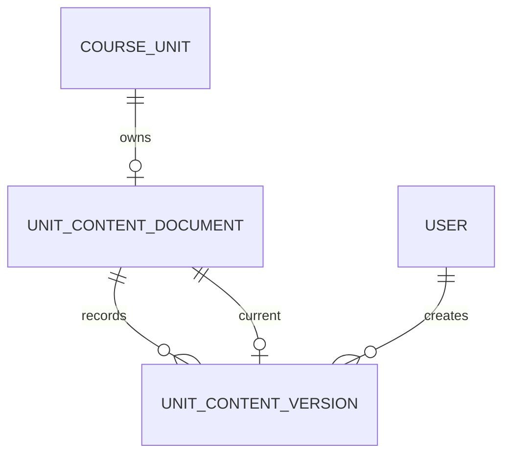

## Transacción de guardado

```mermaid
sequenceDiagram
    participant UI as Editor
    participant API as Content API
    participant DB as PostgreSQL
    UI->>API: PUT JSON + expected_document_version
    API->>DB: BEGIN; lock revision and unit
    API->>DB: lock or create document safely
    API->>API: pre-scan, schema, semantic and security validation
    API->>API: canonical JSON, text, metrics and SHA-256
    alt digest unchanged
        API->>DB: COMMIT without version
    else changed
        API->>DB: INSERT immutable version; UPDATE current pointer
        API->>DB: COMMIT
    end
    API-->>UI: current document representation
```

## Guardados concurrentes

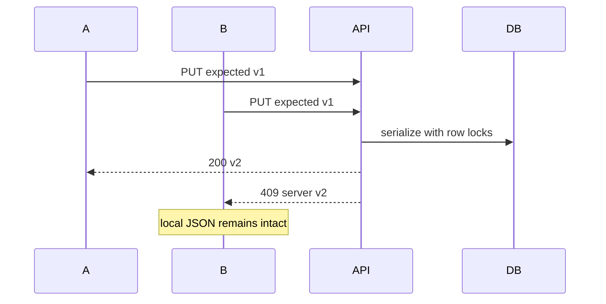

## Restauración

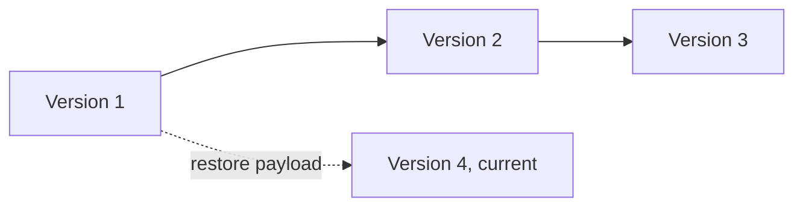

## Validación del schema

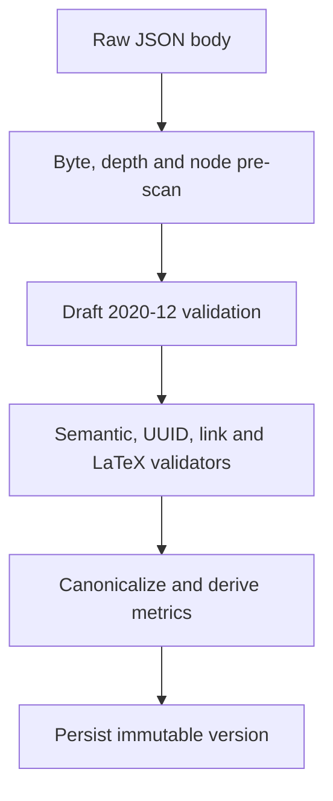

## Schema del editor

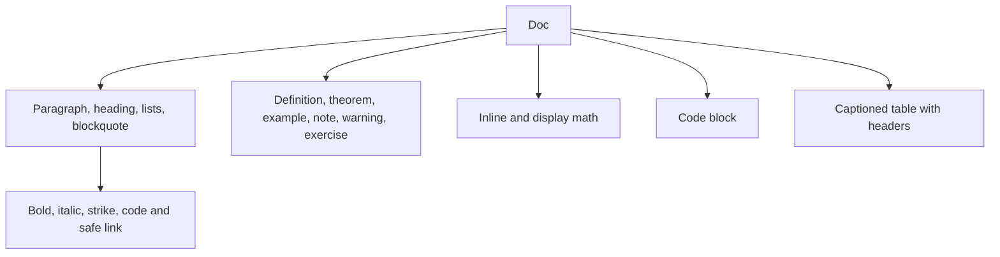

## Renderizado

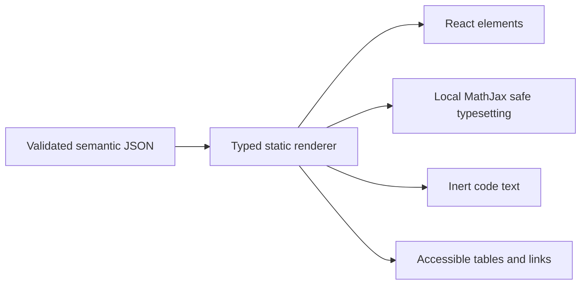

## Edición matemática

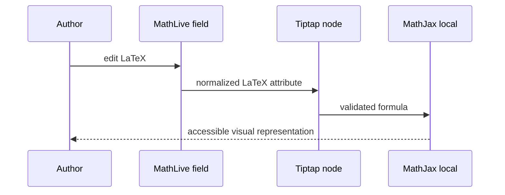

## Extensión de readiness

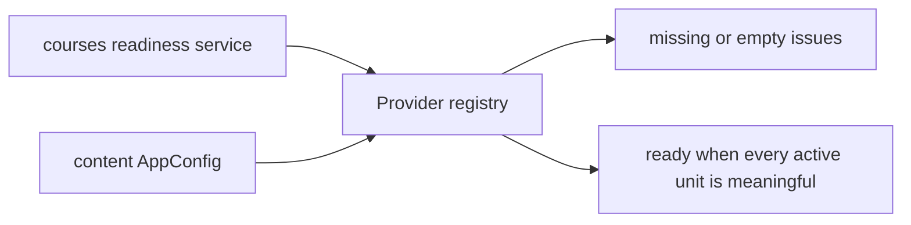

## Rutas frontend

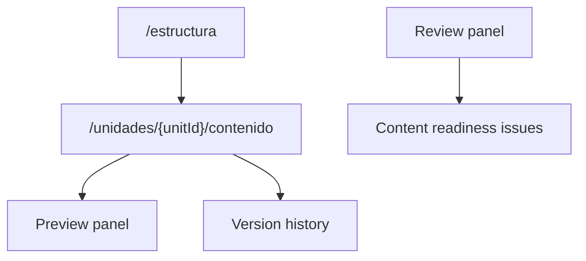

## Frontera de seguridad

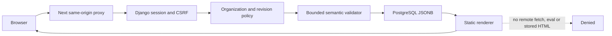

## Generación de schema y tipos

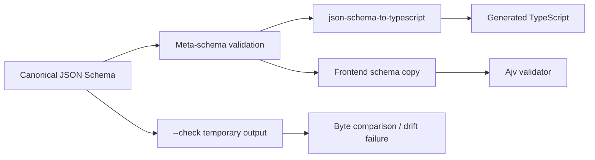

## Consecuencias

La representación es auditable, determinista y segura por construcción; se evita
un segundo contrato frontend y se preserva la historia completa. El coste es
mantener migraciones explícitas del schema, extensiones Tiptap propias y assets
locales de matemática. Los documentos tienen límites estrictos: 1 MiB
serializado, 5.000 nodos, profundidad 32, 300.000 caracteres, 1.000 bloques
superiores, tablas de 100 × 20, código de 50.000 caracteres y fórmulas acotadas.

## Alternativas rechazadas

- HTML/Markdown como fuente de verdad: mezcla semántica y presentación, aumenta
  el espacio XSS y dificulta evolución estructural.
- Guardado destructivo o sobrescritura de versiones: pierde trazabilidad.
- Autosave o almacenamiento local: introduce estados ocultos y conflictos fuera
  del contrato transaccional.
- KaTeX, CDN o ejecución de código: contradicen el renderer decidido y el límite
  de seguridad de esta fase.
- Importar `content` desde `courses`: crea inversión/ciclo de dependencias.
- Publicar la revisión aprobada: pertenece a una fase posterior con snapshots
  inmutables completos.
