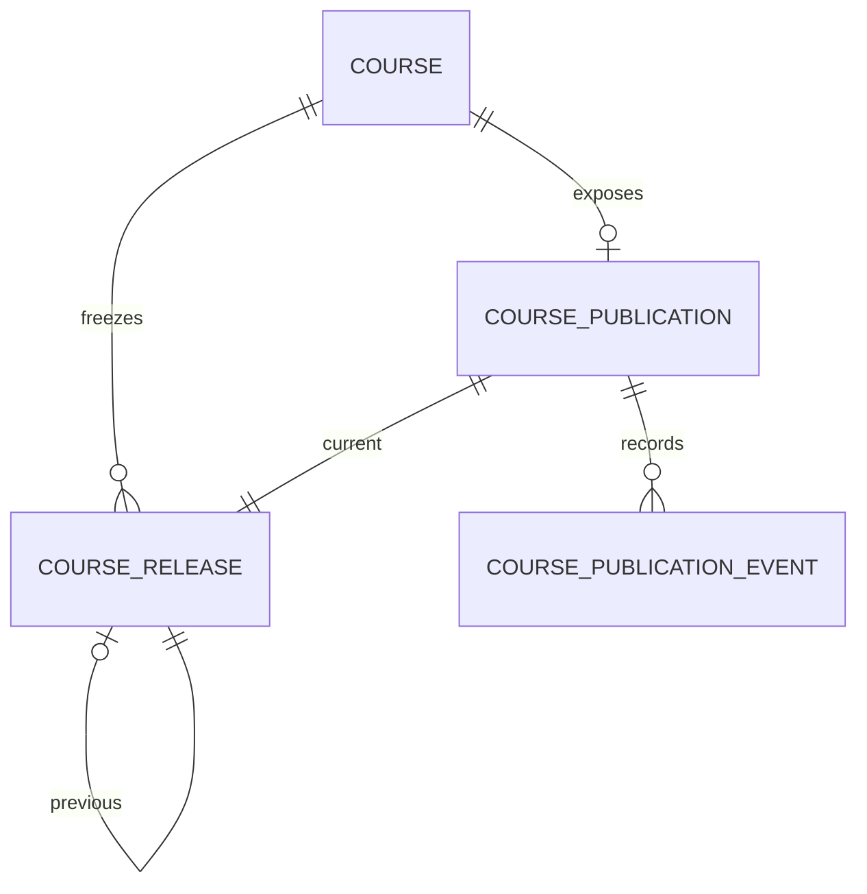
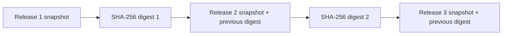
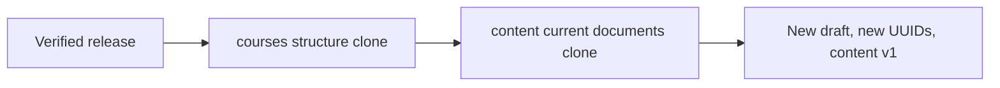
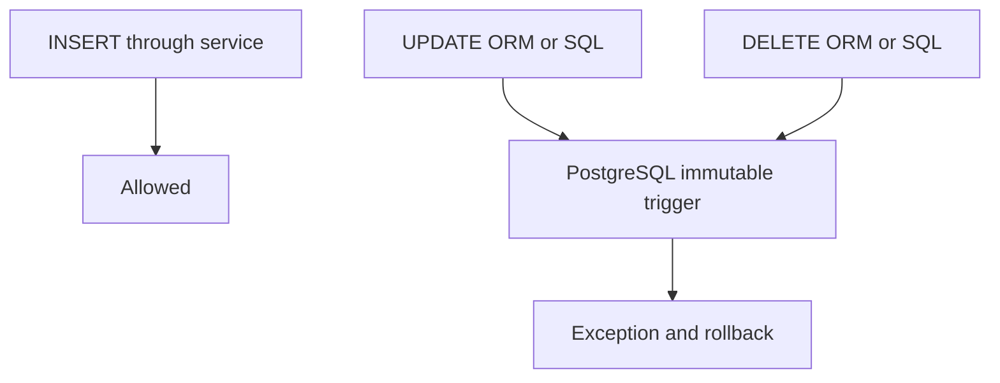
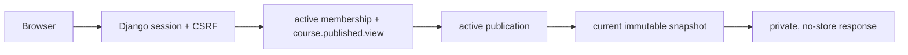

# ADR 0021 — Immutable course releases and institutional publication channel

- Estado: Accepted
- Fecha: 2026-07-30
- Decisores: arquitectura LMS
- Alcance: `domain.publishing`, publicación institucional y primera lectura

## Contexto

Una revisión aprobada demuestra que la autoría terminó, pero no debe convertirse
por sí sola en material entregado. La lectura estudiantil necesita una versión
completa que sobreviva cambios posteriores en curso, catálogo y contenido, y la
institución necesita retirar disponibilidad sin reescribir la historia.

## Decisión

Se crea `domain.publishing`. `CoursePublication` representa el canal actual de
un curso y conserva estado `active` o `withdrawn`, `current_release` y una
`lock_version` optimista. `CourseRelease` representa un hecho secuencial,
inmutable y único por revisión aprobada. `CoursePublicationEvent` conserva las
publicaciones, retiros y drafts creados desde un release. `courses`, `content`,
`catalog`, `organizations` e `identity` no importan `publishing`.

Cada release contiene un snapshot JSONB autocontenido de organización mínima,
metadata del curso, alineaciones curriculares, módulos, unidades y el documento
semántico vigente de cada unidad. El contrato canónico es JSON Schema Draft
2020-12 bajo `schemas/publication/`; no contiene HTML renderizado, actores,
credenciales, permisos, datos de edición ni progreso. Los arrays conservan el
orden académico explícito y las claves se canonicalizan sólo para calcular el
artefacto.

El digest es `SHA-256` de los bytes UTF-8 producidos por `json.dumps` con claves
ordenadas, separadores compactos y sin NaN. Cada snapshot incorpora el digest
del release anterior y cada fila enlaza `previous_release`. Esta cadena detecta
alteraciones; no es firma digital, prueba de identidad, blockchain ni sellado de
tiempo externo.

La publicación usa una única `transaction.atomic()`: bloquea curso, revisión y
publicación; compara la versión esperada; verifica la cadena; ejecuta readiness;
construye y valida el snapshot; crea release, actualiza el canal e inserta el
evento. La unicidad de `source_revision` aporta idempotencia natural. Los locks
y la unicidad `(course, number)` serializan numeración concurrente. Una revisión
anterior al release vigente no puede desplazarlo.

Retirar conserva `current_release`, exige justificación y crea un evento en la
misma transacción. No existe restore/unwithdraw ni rollback automático. Sólo un
release nuevo desde una revisión aprobada posterior reactiva el canal.

`CourseRelease` y `CoursePublicationEvent` rechazan update/delete en modelo,
servicios y admin. Además, triggers PostgreSQL `BEFORE UPDATE OR DELETE`
ejecutan una función PL/pgSQL reutilizable que falla de forma explícita. INSERT y
TRUNCATE no se bloquean para no impedir migraciones o limpieza controlada.

Crear un draft desde un release verifica primero su integridad y orquesta dos
contratos públicos: `courses` clona la estructura de la revisión aprobada y
`content` clona únicamente cada documento vigente como versión 1. Se generan
UUID estructurales nuevos, se conserva contenido/digest y no se copian
transiciones ni versiones históricas.

La biblioteca institucional requiere sesión, membresía activa y
`course.published.view`. Lista únicamente publicaciones activas y resuelve
detalle, outline, unidad y navegación desde `CoursePublication`,
`CourseRelease.snapshot`, sin consultar tablas vivas de autoría o catálogo.
Las respuestas y los Server Components usan `private, no-store`; no hay acceso
anónimo, archivo público, JWT ni almacenamiento del navegador.

## Relaciones



## Snapshot y cadena



## Publicación transaccional

```mermaid
sequenceDiagram
  participant UI as Owner UI
  participant P as Publishing service
  participant DB as PostgreSQL
  UI->>P: publish revision + expected version
  P->>DB: BEGIN; lock course, revision, publication
  P->>P: authorize, readiness, chain, schema
  P->>DB: INSERT release
  P->>DB: INSERT/UPDATE publication; INSERT event
  P->>DB: COMMIT
```

## Retiro

```mermaid
sequenceDiagram
  participant A as Administrator
  participant P as Publishing service
  participant DB as PostgreSQL
  A->>P: withdraw + note + expected version
  P->>DB: lock publication
  P->>DB: status withdrawn; preserve current release
  P->>DB: append withdrawal event; COMMIT
```

## Draft desde release



## Inmutabilidad



## Solicitud de biblioteca



## Consecuencias y evolución

El artefacto publicado es portable, determinista y auditable, y el retiro no
destruye historia. El coste es almacenar una copia completa por release y leer
el JSONB completo para una unidad; se limita a 100 módulos, 2.000 unidades,
5.000 objetivos, 20.000 referencias de tema y 50 MiB canónicos.

Se rechazan punteros a datos vivos, edición/regeneración de releases, historial
genérico, restore directo, publicación al aprobar, caché pública, firma con
claves, Merkle trees y blockchain. Matrículas añadirán otra frontera de acceso;
un CDN futuro requerirá autorización revocable y otro ADR, sin cambiar el
significado del snapshot.
