# Architecture

## Decision

Use a monorepo containing an independently built Next.js web application and a deployable Django modular monolith. Django exposes REST under `/api/v1`; an initial production reverse proxy presents a single HTTPS origin, forwarding `/api`, `/_allauth`, static media routes as configured, and web traffic to Next.js. PostgreSQL is the transactional system of record. Redis supports cache, rate-limit counters, and Celery coordination only. S3-compatible storage holds validated blobs, with metadata and permissions in PostgreSQL.

Operational endpoints `/health/live/` and `/health/ready/` remain outside `/api/v1` and OpenAPI. Liveness has no dependencies; readiness currently checks PostgreSQL only.

The architecture accepts the candidate stack with two constraints: (1) Celery workers run on Linux containers because Celery does not support Windows; (2) `django-csp` is rejected because Django 6.0 includes a CSP framework, reducing an unnecessary dependency.

## C4 context

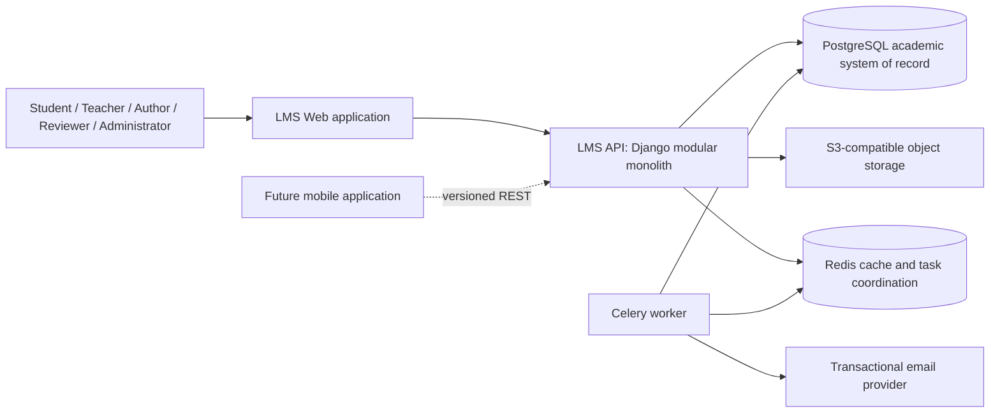

## Containers

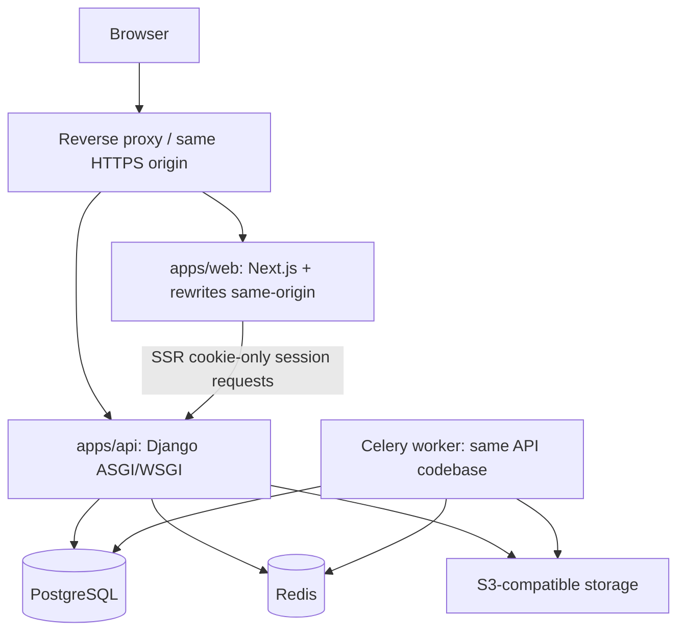

## Backend module map

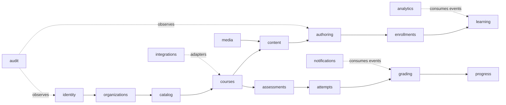

## Frontend module map

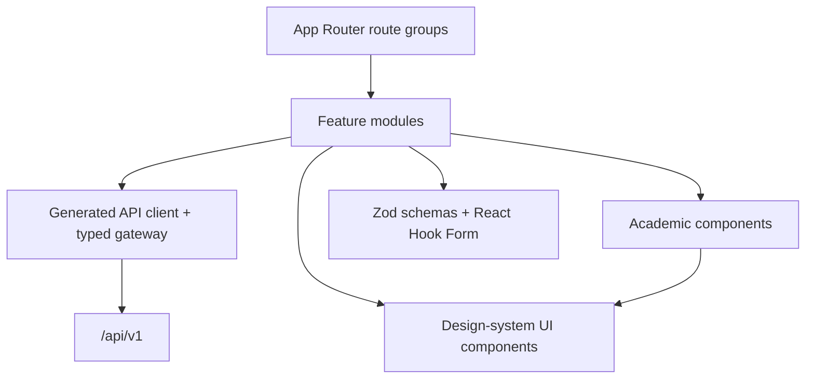

## Cross-cutting rules

- A Django application owns its models, migrations, selectors/use cases, API adapters, and tests. Dependencies point toward published internal contracts, not another app's private models or tables.
- Writes with real invariants use explicit application services and `transaction.atomic`; side effects use `transaction.on_commit` plus an outbox/task boundary. Trivial CRUD stays direct and readable.
- Reads may use focused selectors. There is no generic repository layer around the Django ORM and no business rule in signals.
- Controllers/serializers and React components are thin adapters. No frontend calculation is authoritative for grades, permissions, attempts, or publication.
- Internal asynchronous events are domain facts with an outbox record; they are not a premature event-sourcing system.

## Critical sequences

### Session authentication

```mermaid
sequenceDiagram
  participant B as Browser
  participant W as Next.js
  participant P as Same-origin proxy
  participant A as Django/allauth
  B->>W: sign-in form and CSRF context
  W->>P: POST /_allauth/... with credentials and CSRF token
  P->>A: forward HTTPS request
  A->>A: rate limit, authenticate, verify policy/MFA state
  A-->>B: Set-Cookie HttpOnly Secure session; response has no persistent JWT
  B->>W: navigate with session cookie
  W->>P: SSR request /api/v1/... forwarding cookie
  P->>A: authenticated API request + CSRF for unsafe methods
  A-->>W: authorized typed response
```

### Publication

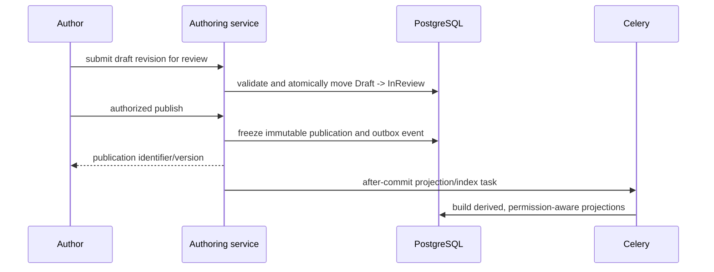

### Attempt and grading

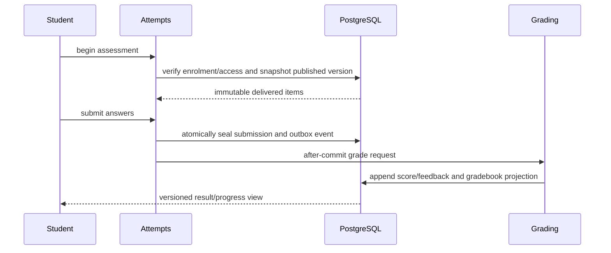

### Content versioning

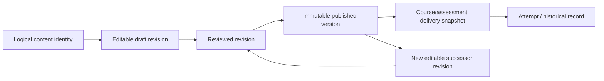

## Explicit rejections

Microservices, Kubernetes, GraphQL, full CQRS, event sourcing, an all-purpose `core` app, a generic ORM repository, browser-persisted JWTs, and CORS middleware for the same-origin production model are rejected initially. Reconsider only through evidence and an ADR.
# Arquitectura

La autorización institucional se resuelve en `organizations`: la identidad es
global, las membresías UUID delimitan cada organización y las capacidades se
calculan por roles activos en cada solicitud. Las mutaciones usan servicios
transaccionales; Next.js usa la URL como contexto y Django mantiene autoridad.

## Catálogo curricular (Prompt 8)

`catalog` es propietario de Área → Disciplina → Asignatura, el árbol
materialized-path de temas, conceptos reutilizables, objetivos, asociaciones
ordenadas y dos DAG de prerrequisitos. Los servicios bloquean la asignatura
para mutar el árbol y la organización para mutar grafos; PostgreSQL mantiene la
transacción y Treebeard conserva `path`, `depth` y `numchild` como internos.

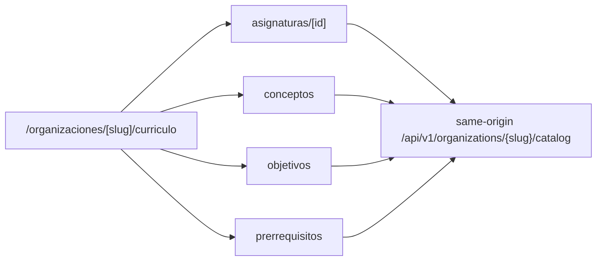

Los módulos futuros `courses` y `progress` sólo podrán leer contratos públicos
de `catalog`; una relación curricular no concede acceso a contenido ni crea
progreso estudiantil.

## Courses y autoría estructural (Prompt 9)

`domain.courses` depende de las políticas de `organizations` y de referencias
activas de `catalog`; ninguno de esos módulos importa `courses`. Las escrituras
entran por servicios atómicos. `Course` conserva identidad, `CourseRevision`
metadata/estado/`lock_version`, y `CourseModule`/`CourseUnit` la jerarquía
ordenada. Una estructura aprobada permanece privada y no es publicación.

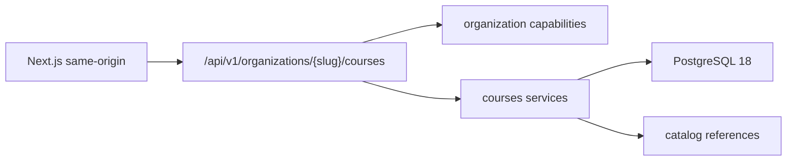

## Contenido semántico de unidades (Prompt 10)

`domain.content` añade una proyección semántica versionada a `CourseUnit` sin
mover la jerarquía de `courses`. El schema canónico vive en la raíz y alimenta
jsonschema, Ajv y generación TypeScript. La escritura es servicio transaccional;
la lectura del frontend es React estático y componentes especializados.

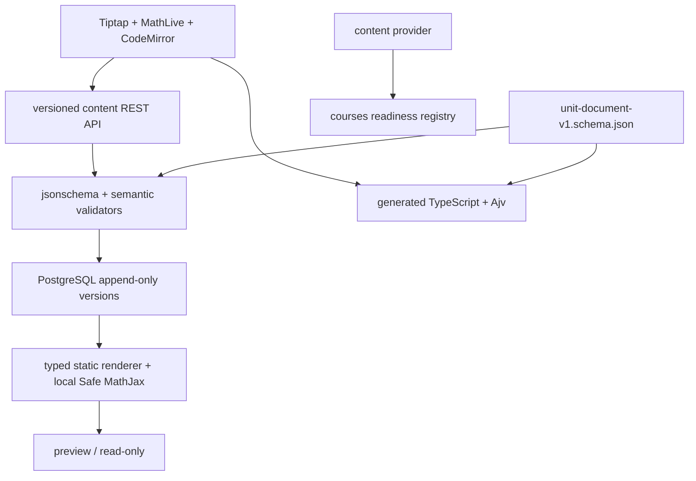

La frontera browser continúa same-origin con sesión y CSRF Django. No hay CDN,
HTML persistido, autosave, colaboración, ejecución, almacenamiento local ni
servicio nuevo. ADR 0020 contiene las doce secuencias/diagramas detallados.

# Publicación inmutable (Prompt 11)

`domain.publishing` transforma revisión aprobada y contenido actual en snapshot
completo, ordenado, validado y encadenado. PostgreSQL conserva release y eventos
append-only; Next y DRF sirven la biblioteca sólo desde ese JSON. ADR 0021 y
`PUBLISHING.md` contienen la decisión y diagramas.

# Entrega del aprendizaje (Prompt 12)

`domain.learning` enlaza membresía y curso mediante una matrícula estable cuya
asignación activa fija un `CourseRelease`. Progreso y continuidad se escriben
con locks/versiones y toda lectura usa el snapshot asignado. ADR 0022 y
`LEARNING.md` contienen las reglas y catorce diagramas normativos.

# Calificación avanzada (Prompt 14)

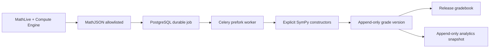

`domain.assessments` sigue siendo único propietario. Redis DB 2 transporta IDs
de job en JSON y nunca es fuente de verdad. El HTTP sólo valida y encola; SymPy
corre en el worker Linux. Regrading parte de una revisión explícita, bloquea e
idempotiza por intento y conserva manual grades. Gradebook y analytics son
proyecciones reconstruibles sobre releases/grades, no progreso del curso.

## Assets académicos privados

ADR 0025 añade `domain.assets` como proveedor aguas arriba. AWS S3 es el
contrato, LocalStack sólo una implementación local. Browser sube directamente a
quarantine; un job Celery durable ejecuta ClamAV y pipelines acotados antes de
crear variantes privadas. Content fija `AssetVersion`, publication incluye su
manifest en el digest y learning firma variantes sólo para la matrícula y
release efectivos. Véanse los diagramas en `ASSETS_AND_MEDIA.md`.
