# Assets and media

## Frontera y modelo

`domain.assets` administra recursos privados; no estructura cursos, publica,
matricula ni evalúa. Content fija versiones, publishing captura el manifest y
learning autoriza la entrega del snapshot asignado.

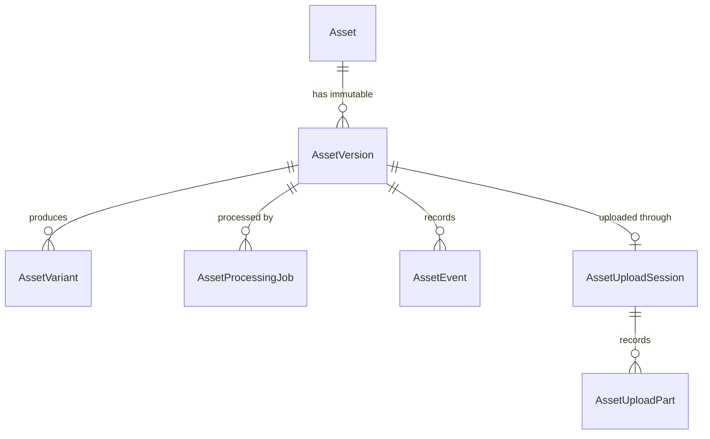

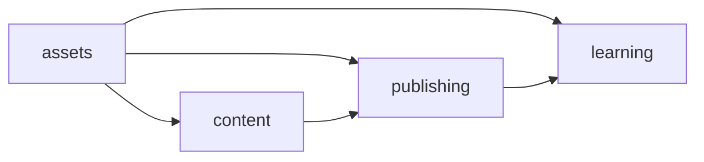

## Upload y cuarentena

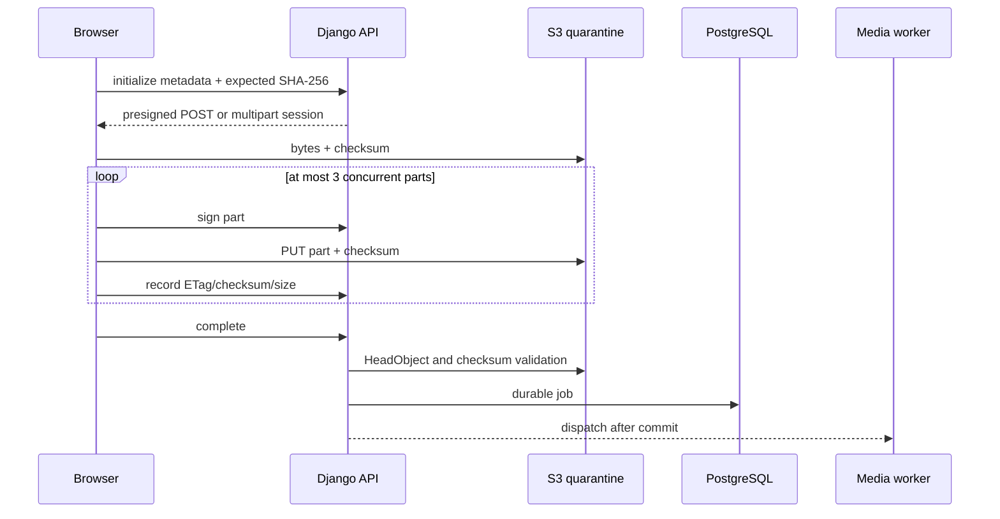

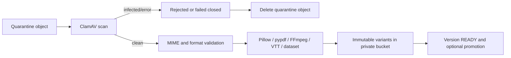

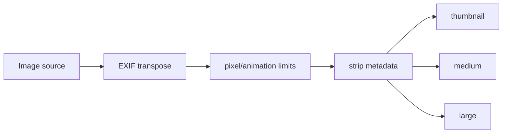

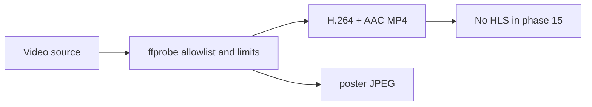

## Referencias, release y entrega

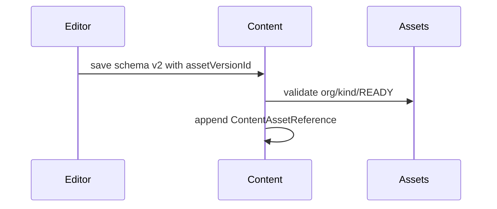

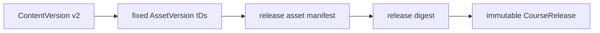

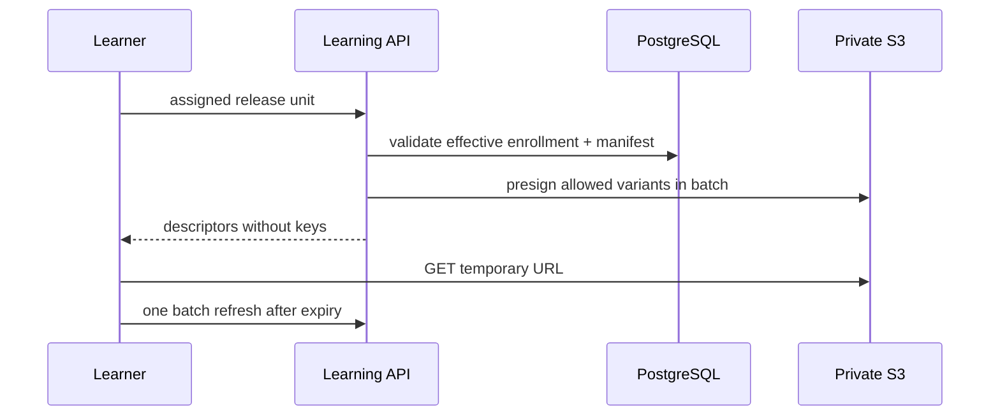

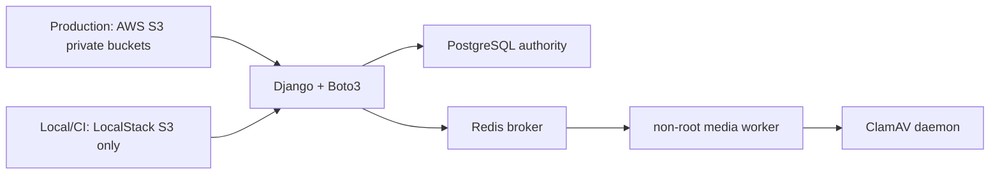

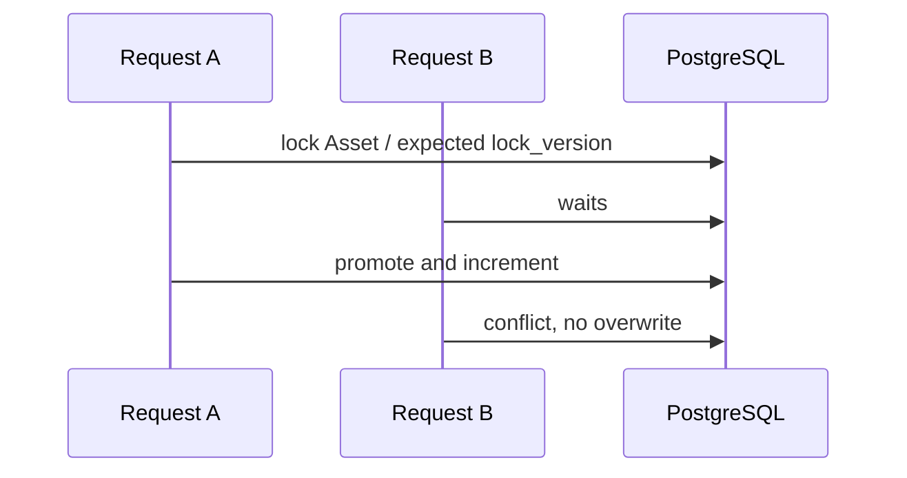

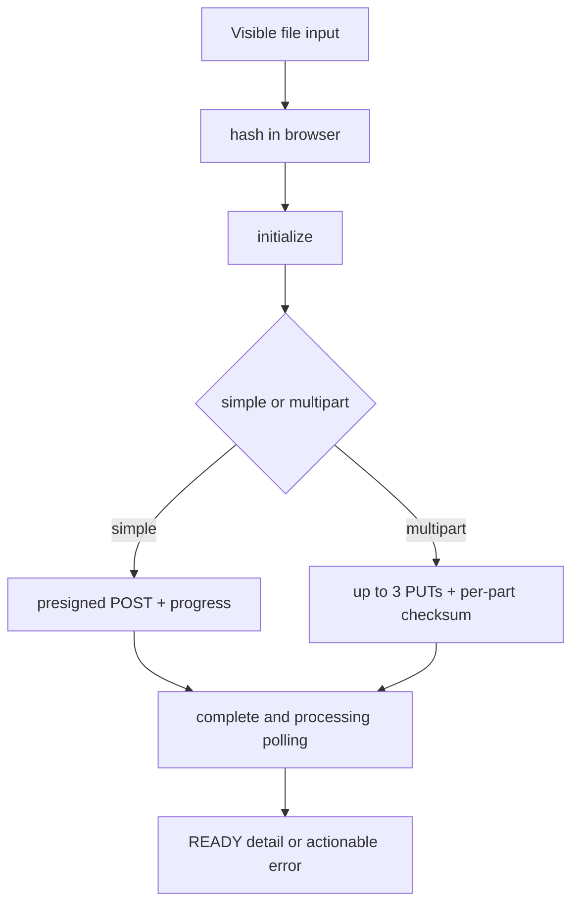

## Operación

- `pnpm storage:init` aplica buckets, encryption, versioning, CORS y lifecycle.
- `pnpm media:build && pnpm media:up` levanta ClamAV y el worker reproducible.
- `pnpm assets:demo` crea siete assets propios y pasa por el pipeline real.
- `pnpm assets:smoke` comprueba storage, workers y EICAR generado en runtime.
- `reconcile_asset_storage` reporta faltantes/checksums; no repara de forma
  implícita.
- `expire_stale_upload_sessions` aborta sesiones vencidas de forma idempotente.

Los endpoints internos, credenciales y object keys nunca llegan al bundle. Las
URLs firmadas son descriptores temporales y no se persisten en documentos ni
releases.
