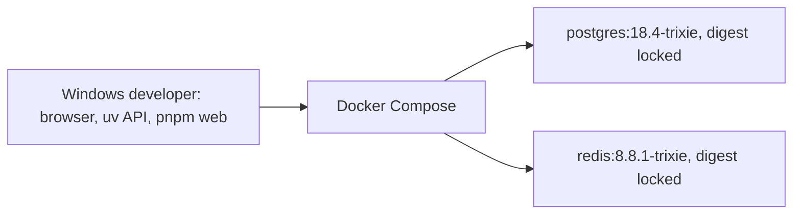
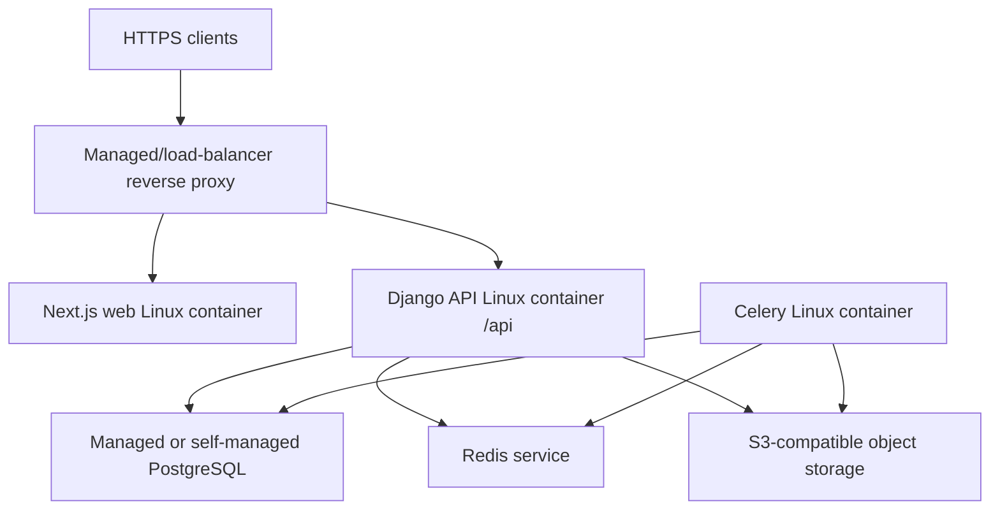

# Deployment architecture

## Local development

Native Windows runs the web/API development process. PostgreSQL and Redis are the only Compose services in this phase, both bind only to loopback and use named volumes. `compose.lock.yaml` pins Linux amd64 manifests; PostgreSQL 18 stores its cluster under the `/var/lib/postgresql` volume. Celery, object storage, mail emulation, and a reverse proxy remain out of scope.

The application exposes non-versioned `/health/live/` and `/health/ready/` for orchestration. Liveness has no dependency. Readiness checks PostgreSQL and the public Django cache API backed by Redis, because Redis now enforces authentication rate limits; neither endpoint reveals the failed dependency.

## Initial production

No Kubernetes is introduced. Containers are separately deployable but not microservices: API and worker share one versioned backend image/codebase. Health checks, non-root images, migration-before-rollout, rolling deployment, encrypted backups, restoring tests, observability, and a rollback runbook are required before production. The reverse proxy terminates TLS and preserves the scheme/host headers necessary for secure Django cookies.
# Despliegue

El OpenAPI de plataforma se publica sólo en desarrollo/test; no se añade Swagger
ni Redoc. El frontend reescribe `/api/v1` al origen Django interno y el cliente
server-only reenvía exclusivamente la cookie de sesión con `no-store`.

Prompt 8 no añade servicios: PostgreSQL conserva árbol, asociaciones, grafos y
archivado; Redis continúa reservado para cache y límites de autenticación. No
se almacenan currículo, capacidades ni sesiones en el navegador o Redis.
