# Conceptual domain model

## Aggregates and immutability

`identity.User` is the only implemented identity aggregate: UUID primary key, email authentication and Django permission/session compatibility. `Course`, `ContentDocument`, `Question`, and `Assessment` remain future logical identities with editable revisions; no profile, role or academic relation exists in the current schema.

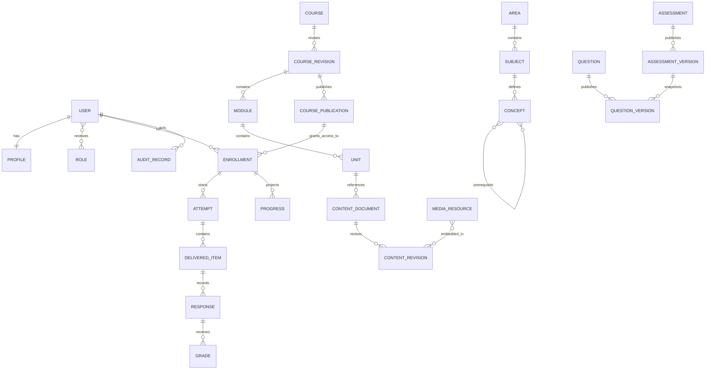

## State transitions

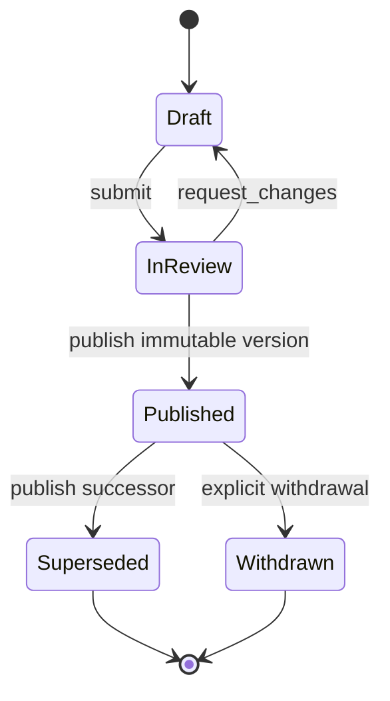

The attempt lifecycle is `not_started → in_progress → submitted → grading → graded`, with `expired` and `voided` only through authorized, audited transitions. A response is append-only after submission; any correction is a separately identified adjudication. Enrolment states include `pending`, `active`, `suspended`, `completed`, `expired`, and `withdrawn`.

## Required end-to-end flow

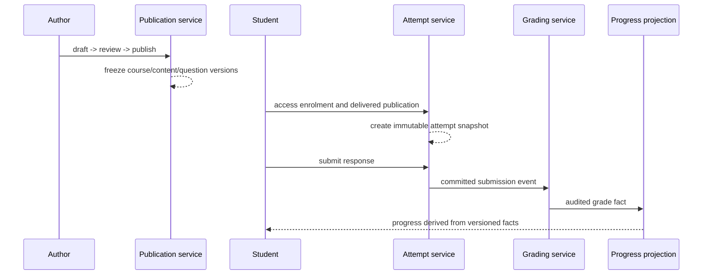

Never retroactively recalculate a delivered question, submitted response, awarded grade, or historical progress without creating a separately versioned/corrected record and preserving provenance.
# Foundational identity

`identity.User` is the only identity model in the first schema. It has UUID `id`, required case-insensitively unique `email`, password/authentication fields, names, flags, groups and permissions. Academic roles, profile data and enrolment belong to later bounded modules.

`account.EmailAddress` is an allauth-owned supporting record, not a second user
model: it tracks the primary/verified email used by mandatory verification and
must remain coherent with `identity.User.email`. No profile, role or academic
relation is introduced by authentication.
# Modelo de dominio

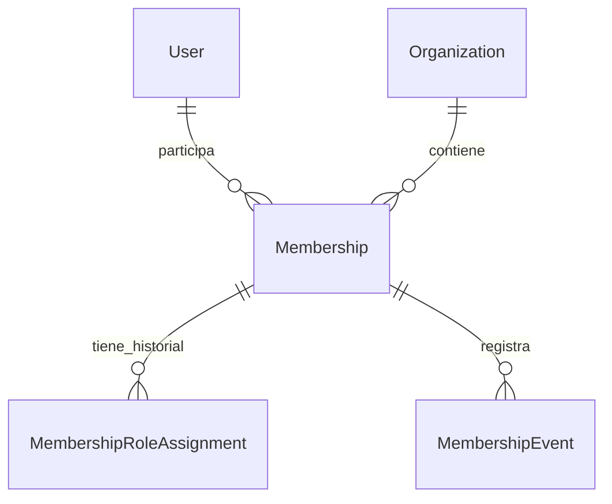

`Membership` tiene UUID y una única fila no revocada por usuario/organización.
Las asignaciones de rol y eventos son históricos; no existen roles globales en
`User`.
# Modelo curricular de Prompt 8

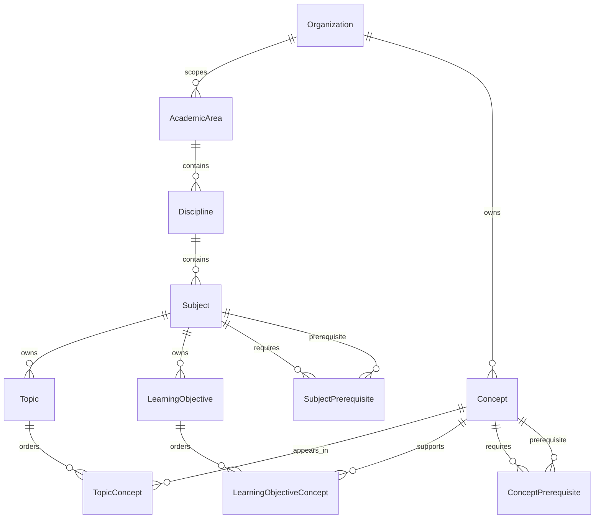

`Topic` hereda `MP_Node`: `path`, `depth` y `numchild` son internos y no se
exponen por REST. Los prerrequisitos son dos DAG separados; una CTE recursiva
parametrizada rechaza ciclos y la fila de organización se bloquea antes de
reemplazar aristas. No hay `GenericForeignKey`, eliminación física ni cursos.

# Modelo de Courses (Prompt 9)

Los siguientes diagramas formalizan ADR 0019.

## 1. Course–Revision

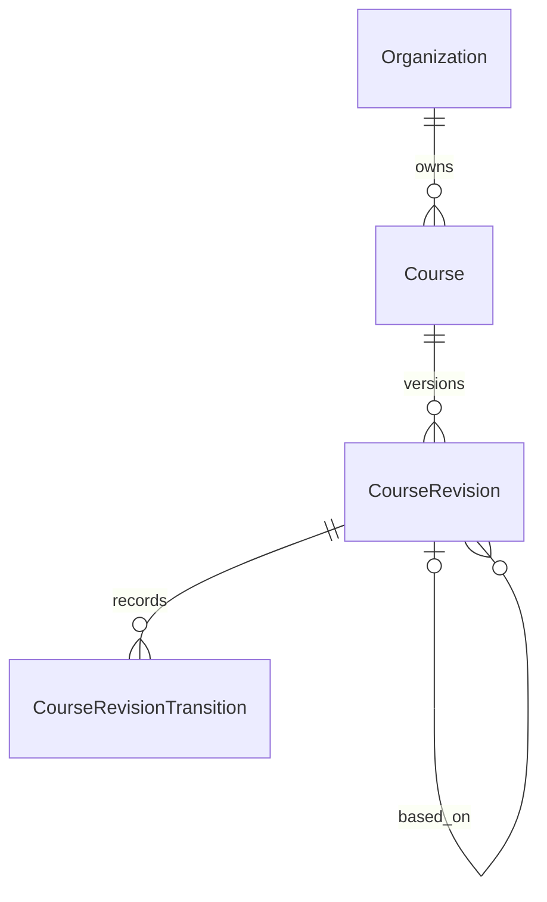

## 2. Revision–Module–Unit

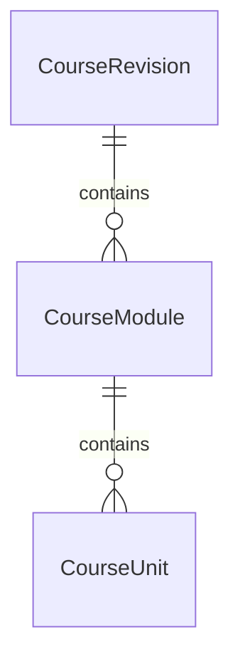

## 3. Revision workflow

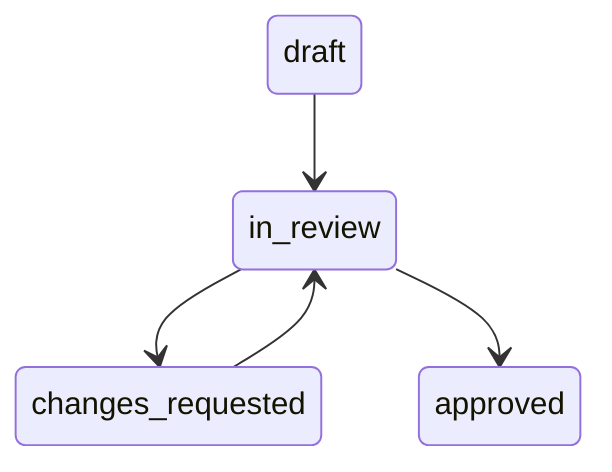

## 4. Optimistic concurrency

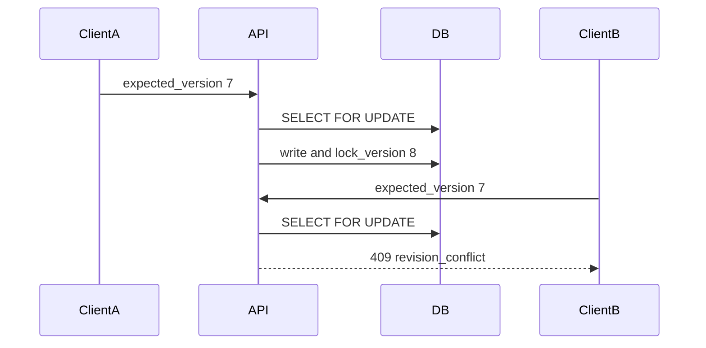

## 5. Module reorder transaction

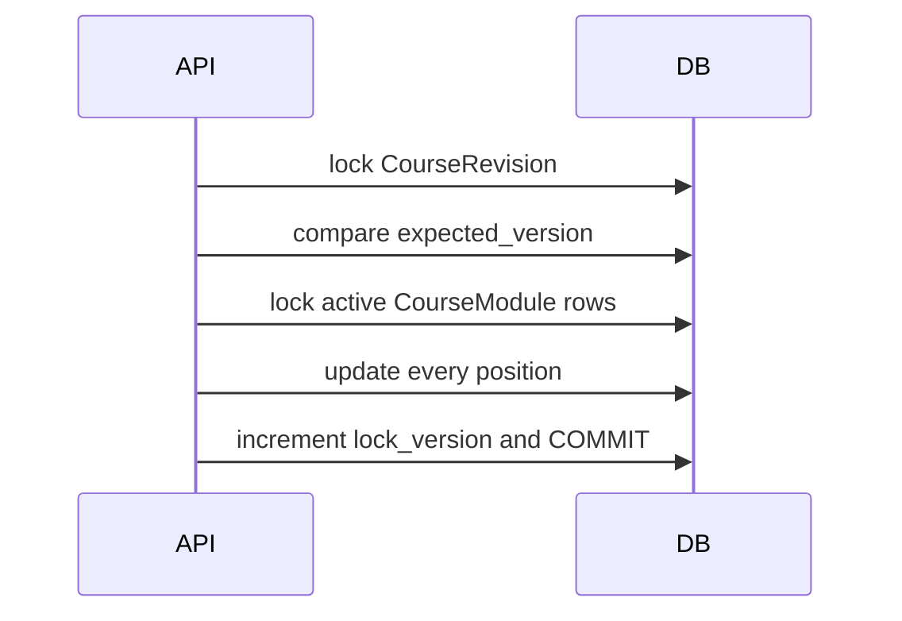

## 6. Unit reorder transaction

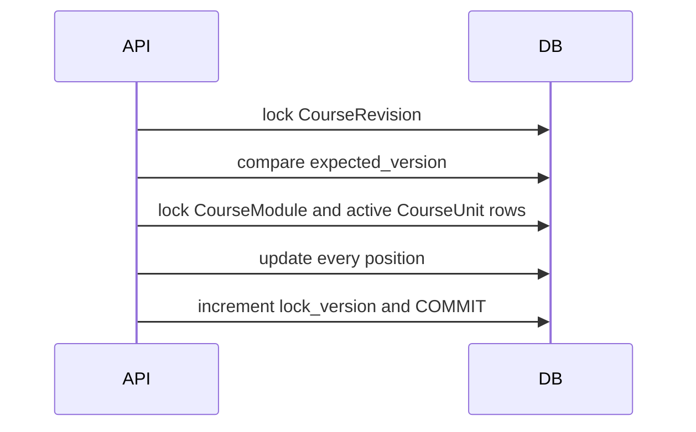

## 7. Course–Subject

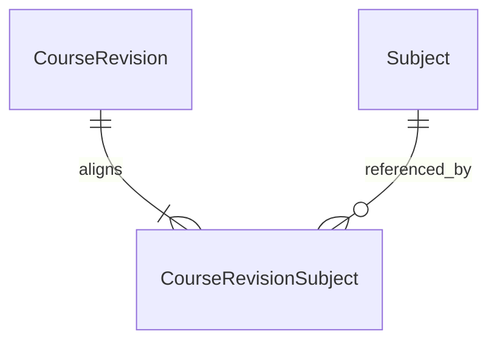

## 8. Course–LearningObjective

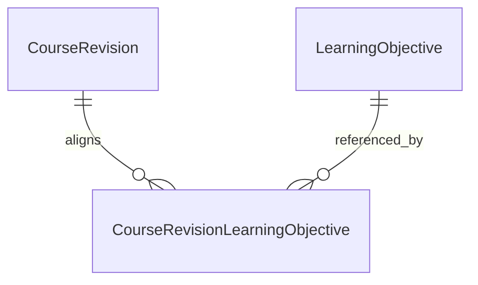

## 9. Unit–Topic

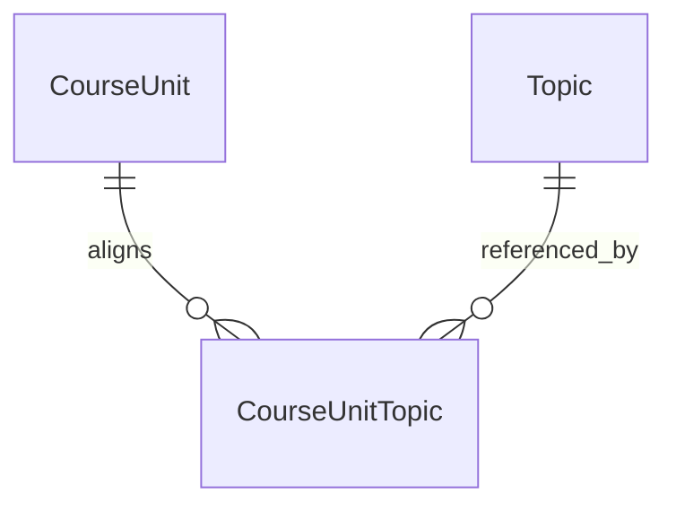

## 10. Unit–LearningObjective

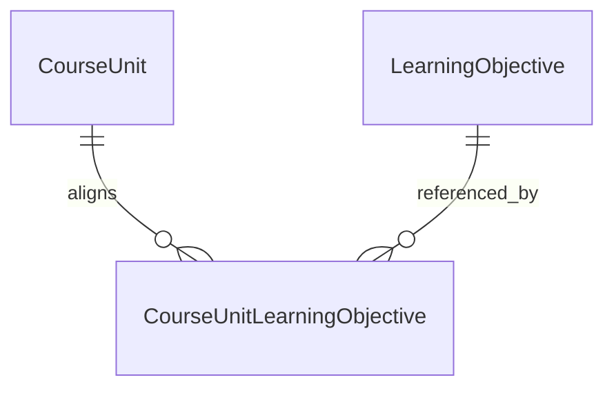

## 11. Organization isolation

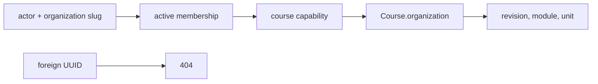

## 12. Frontend course routes

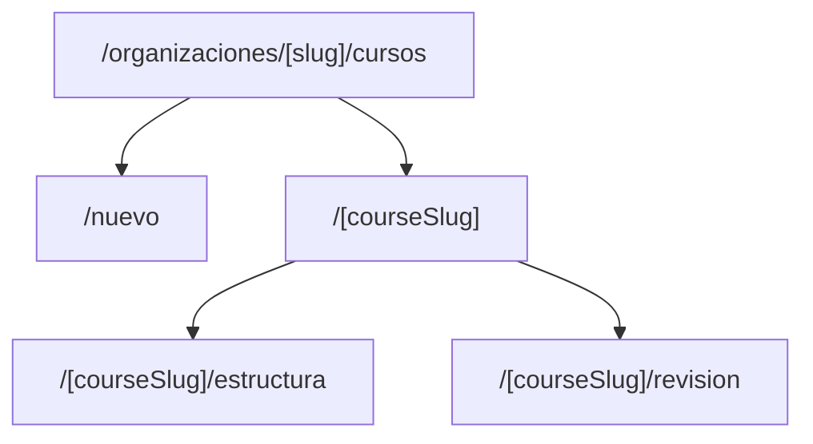
