# Entrega del aprendizaje

Documento normativo de `domain.learning`, conforme a ADR 0022. La publicación
crea una versión legible; la matrícula concede delivery sobre una versión fija.

## Modelo y ownership

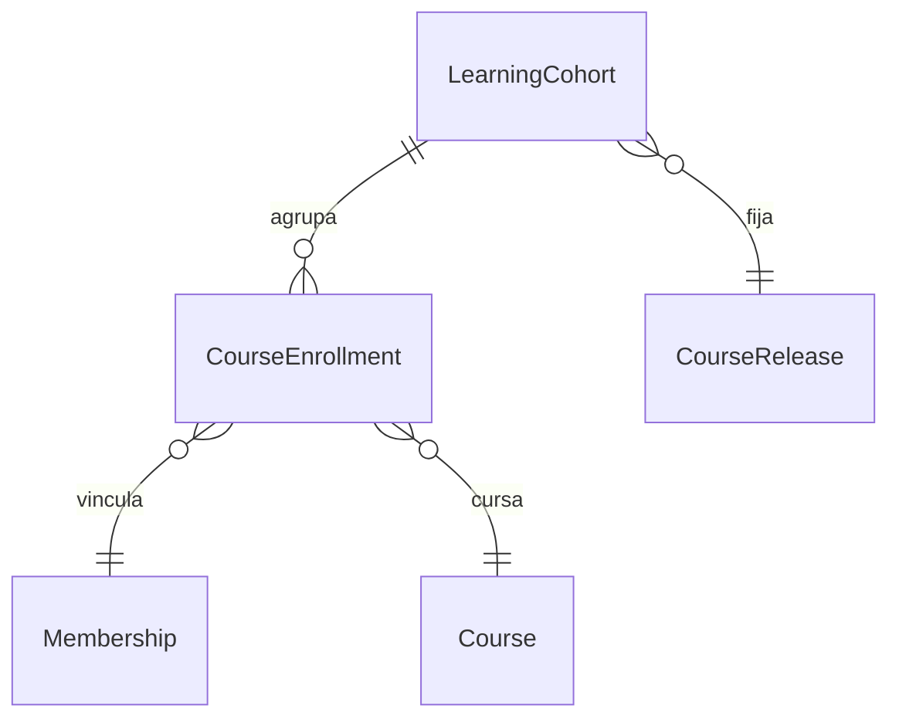

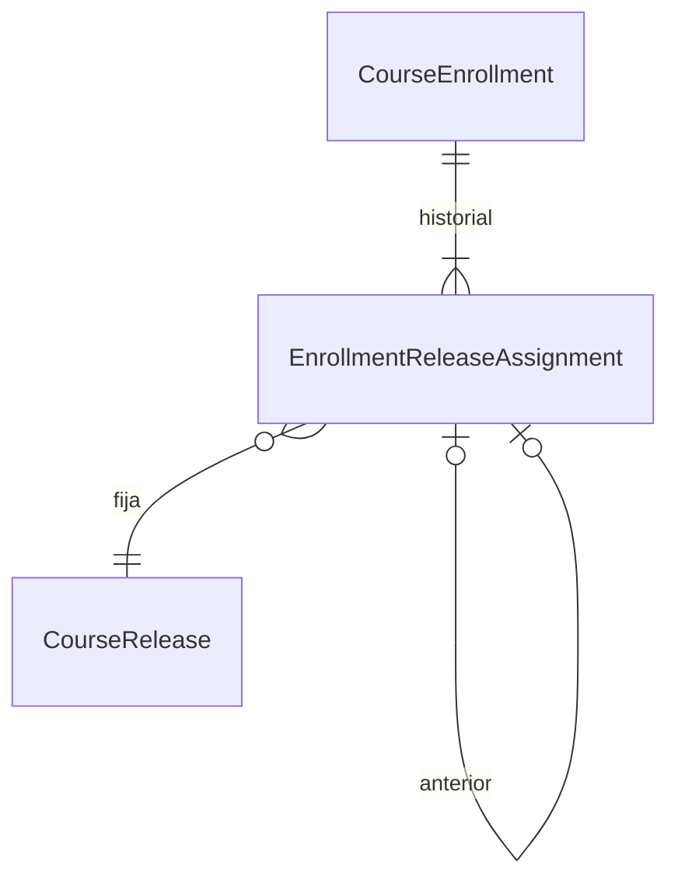

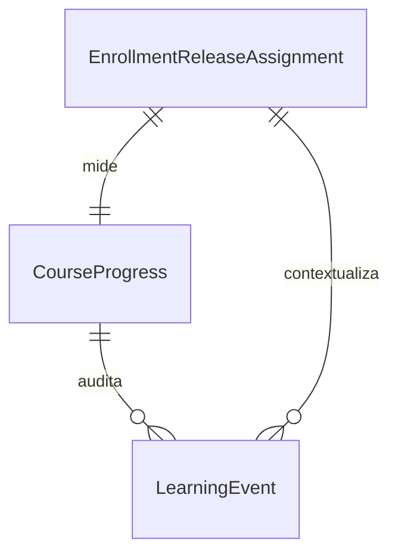

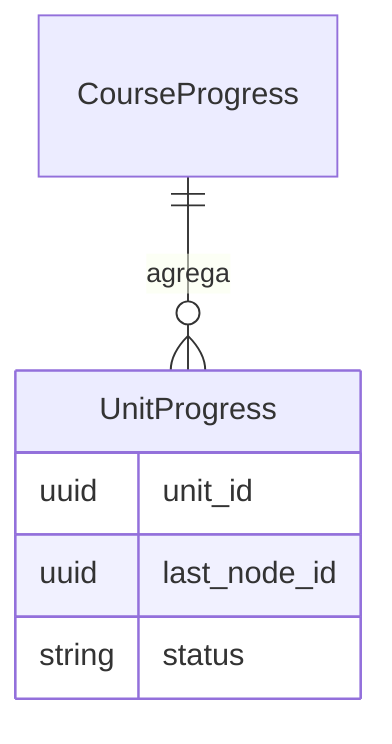

## Transacciones

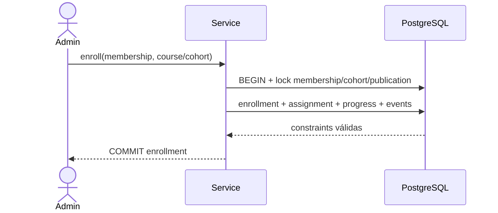

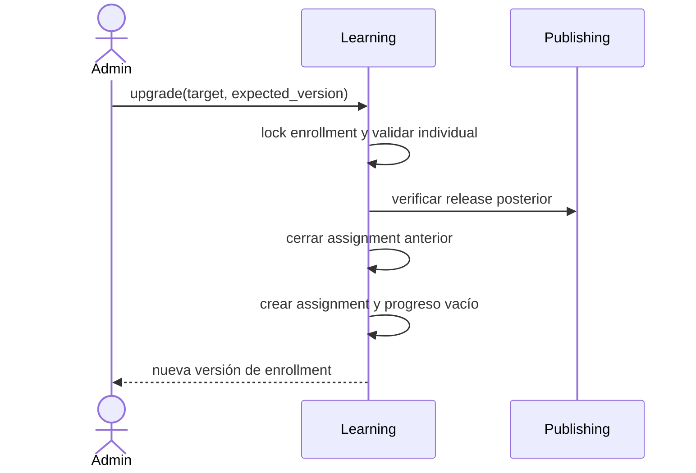

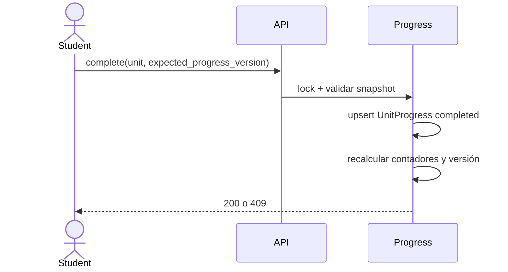

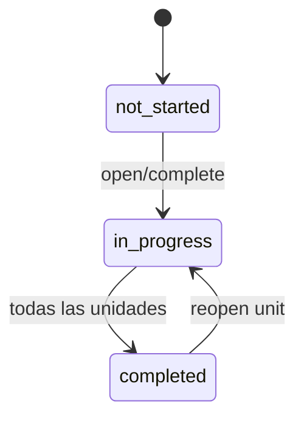

## Continuidad y acceso

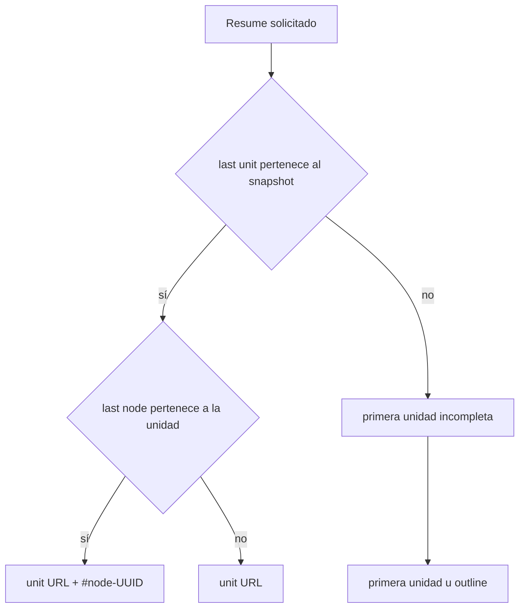

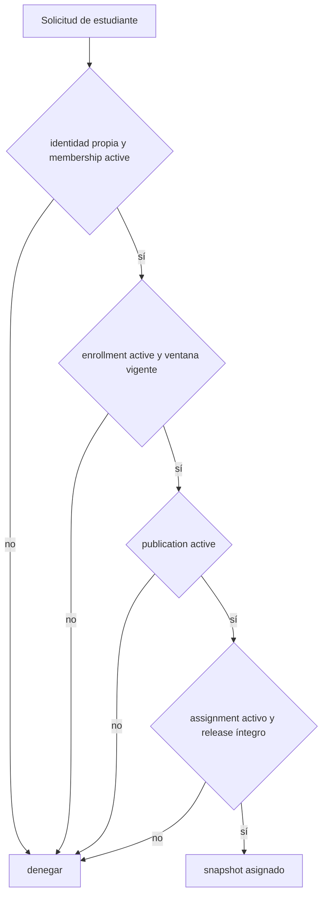

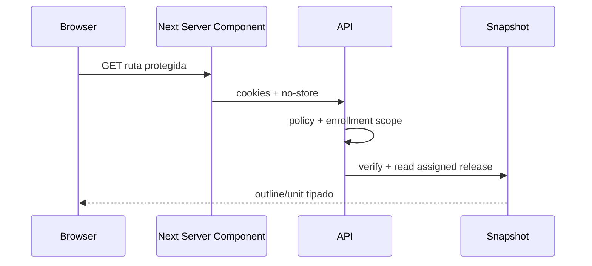

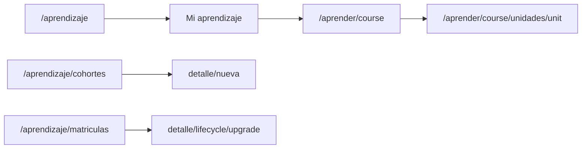

## Concurrencia e inmutabilidad

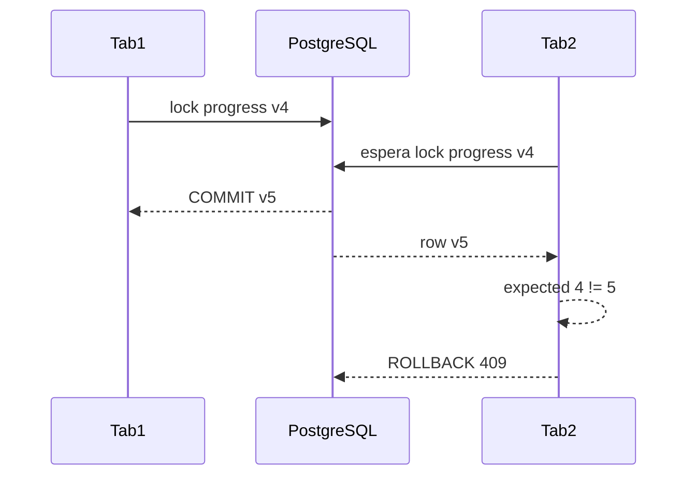

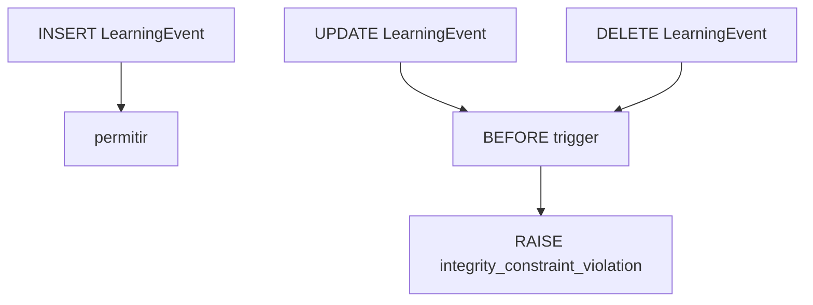

## Reglas operativas

- `active`, `suspended` y `revoked` son estados explícitos; revocación es
  terminal y reincorporación crea otra matrícula.
- Una cohorte archivada impide altas nuevas sin revocar matrículas existentes.
- Las ventanas se copian al matricular y no se actualizan retroactivamente.
- El total de unidades se fija desde el release; el porcentaje usa 0–10 000
  basis points. No hay floats persistidos.
- Ausencia de `UnitProgress` significa `not_started`.
- `open` es idempotente para el evento; `complete` devuelve
  `already_completed`; `reopen` revierte completitud y puede reabrir el curso.
- La posición usa `IntersectionObserver`, debounce de cinco segundos y flush
  `keepalive` en navegación/pagehide. No usa Web Storage ni eventos masivos.
- El dashboard puede mostrar estado suspendido/finalizado/retirado, pero sólo
  `available` abre contenido.
- No existe DELETE en API ni borrado físico de historial.
