# Publicación inmutable

Documento operativo de la fase 11, decidido por ADR 0021. `publishing` es el
único propietario de la proyección publicable de un curso. Una revisión
`approved` sigue siendo autoría; sólo un `CourseRelease` con snapshot validado
es material de biblioteca.

## Modelo, snapshot y cadena

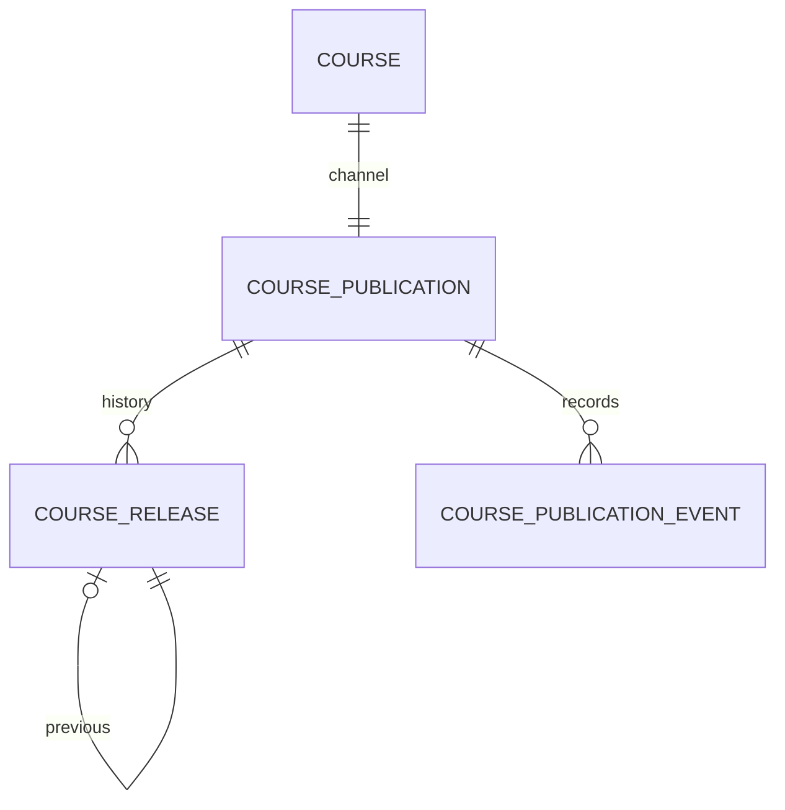

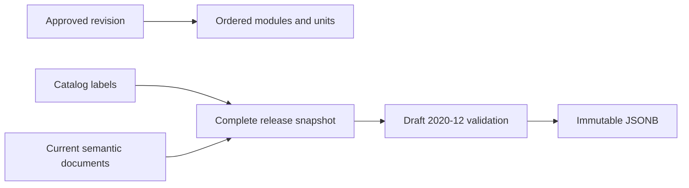

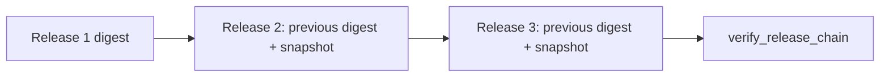

El JSON excluye usuarios, permisos, secretos, HTML, aprendizaje, matrículas y
datos vivos. Se canonicaliza con JSON UTF-8, claves ordenadas y separadores
compactos. Los límites se validan antes de insertar. La biblioteca nunca
recompone el curso desde autoría.

## Transacciones y fronteras

```mermaid
sequenceDiagram
  actor Owner
  participant Service
  participant DB as PostgreSQL
  Owner->>Service: publish(revision, expected lock)
  Service->>DB: BEGIN + row locks
  Service->>Service: readiness + snapshot + schema + digest
  Service->>DB: INSERT release/event; update channel
  Service->>DB: COMMIT
```

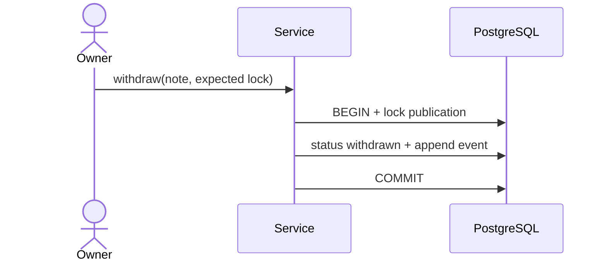

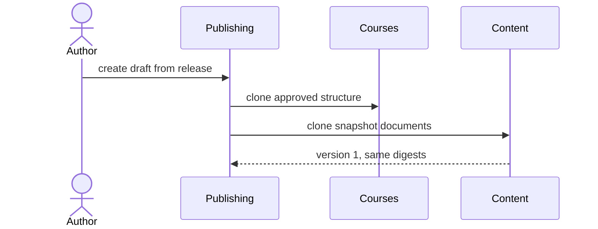

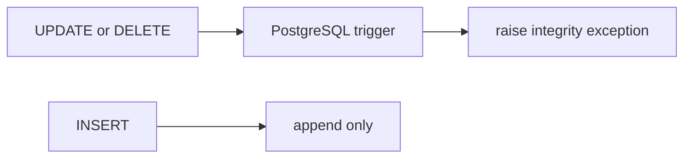

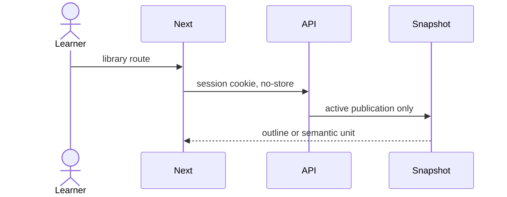

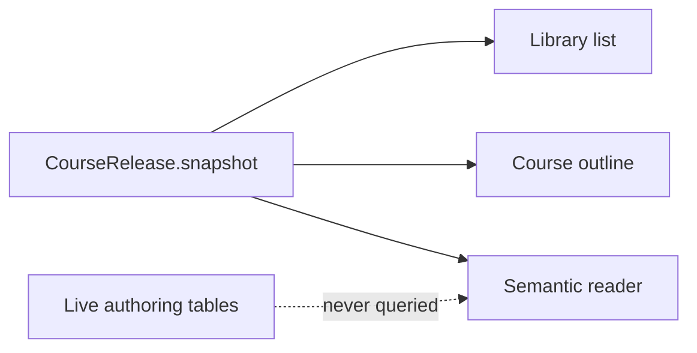

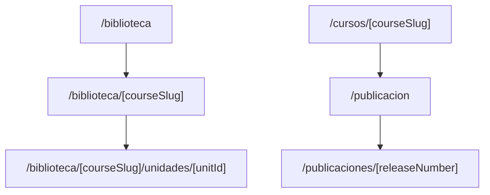

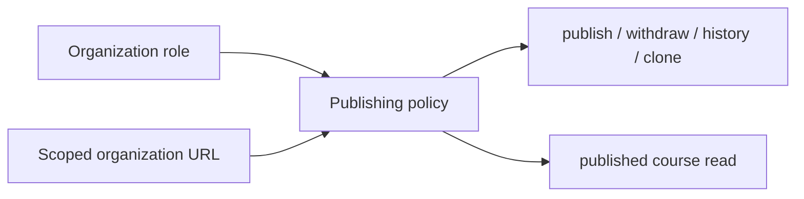

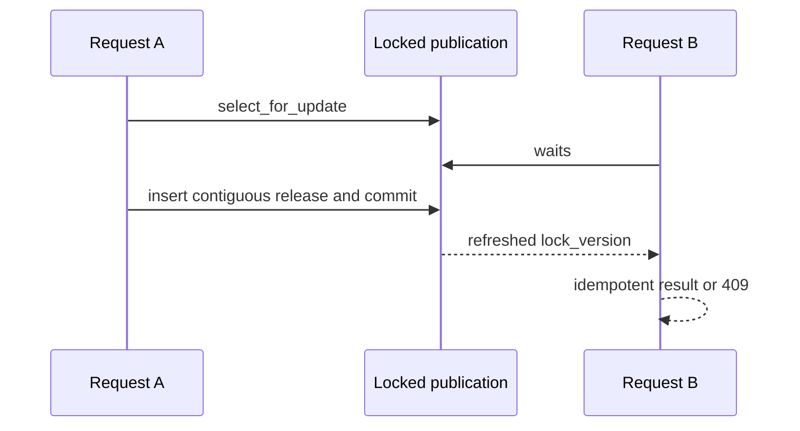

## Operación y garantías

Los triggers `publishing_prevent_course_release_mutation` y
`publishing_prevent_publication_event_mutation` protegen UPDATE/DELETE aun
fuera del ORM. `verify_course_releases` recalcula schema, digest, enlace previo
y cadena sin escribir. El retiro exige nota, conserva releases y eventos y no
restaura una versión anterior. Sólo un release nuevo vuelve a estado activo.

Las respuestas de biblioteca usan `Cache-Control: private, no-store`. Las rutas
exigen sesión y capacidad institucional; una referencia cruzada devuelve 404.
No existe DELETE, restore, body de snapshot, JWT, almacenamiento browser,
matrícula, progreso ni evaluación.
