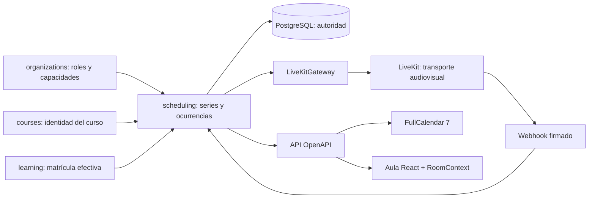

# Scheduling and live classes

## Propiedad y flujo

`domain.scheduling` es el único propietario de series, ocurrencias,
`LiveSession`, asistencia y eventos de webhook. `Course` aporta identidad
académica; el contrato público `domain.learning.contracts` aporta matrícula
efectiva. Ningún módulo previo importa scheduling y ningún estado audiovisual
se copia a cursos, releases, intentos, `User`, browser storage o Redis.

## Invariantes

- La recurrencia acepta sólo `DAILY`, `WEEKLY`, `MONTHLY` y `YEARLY`, exige
  exactamente `COUNT` o `UNTIL` y materializa máximo 366 ocurrencias UTC desde
  una zona IANA.
- `original_starts_at` conserva la identidad de la ocurrencia. Reprogramar no
  cambia la sala; cada escritura usa `lock_version` y alcance `occurrence`,
  `following` o `series`.
- La sala es aleatoria, inmutable y se crea remotamente sólo cuando un host
  autorizado inicia. El feed jamás incluye nombre de sala ni token.
- El token tiene identidad seudónima `user:<uuid>`, nombre institucional
  autorizado, TTL de cinco minutos por defecto, una sola sala y grants mínimos.
  No expone correo. Estudiantes no comparten pantalla salvo que la política lo
  permita; hosts y administradores pueden moderar.
- El webhook es el único origen de asistencia: valida JWT y hash del cuerpo
  crudo, deduplica por UUID y conserva segmentos múltiples por reconexión.
- Los errores del proveedor retornan códigos explícitos `502/503`; no hay
  fallback, credenciales ficticias ni estado optimista que suplante LiveKit.
- Silenciar audio usa `MutePublishedTrack`; no revoca cámara ni pantalla.
  Cambiar permisos se limita otra vez en Django por rol y política, conserva el
  canal de datos sólo si el chat está permitido y valida que el objetivo tenga
  acceso efectivo a esa sesión antes de mutar LiveKit.

## Contratos web

- `/organizaciones/<slug>/calendario` carga el intervalo visible, aborta la
  solicitud anterior al navegar y usa CSS/tema explícito de FullCalendar 7.
- `/organizaciones/<slug>/clases/<sessionId>` y la actividad inmersiva
  `/organizaciones/<slug>/aprender/<curso>/actividades/<activityId>` reciben
  permisos de cámara, micrófono y captura de pantalla. El token se pide al
  confirmar entrada y vive sólo en memoria.
- `Room` se instancia una vez por conexión, se desconecta al desmontar y
  LiveKit maneja reconexión de transporte. La pantalla programada refresca su
  estado sin convertir el navegador en autoridad.

## Grabación privada

- ADR 0040 gobierna Egress. La composición `screen_share` usa una plantilla
  técnica pública, sin sesión del LMS, que sólo renderiza la pantalla
  compartida y el audio de la sala.
- La política publicada sólo permite o prohíbe la grabación y aporta una
  sugerencia inicial. Nunca inicia Egress. El moderador selecciona composición
  y resolución en cada inicio y puede detener y crear nuevos segmentos.
- `LiveSession` conserva el estado operativo actual;
  `LiveSessionRecording` conserva cada ejecución por Egress ID, actor,
  composición, resolución, ruta privada y tiempos. El webhook actualiza el
  segmento exacto sin reemplazar el historial.
- `screen_share` requiere una pantalla publicada. `grid` y `speaker` requieren
  al menos una cámara o pantalla real; el servidor vuelve a validar lo que la
  UI deshabilita para evitar grabaciones vacías.
- La plantilla `screen_share` señala inicio sólo cuando el vídeo remoto emite
  `playing` y señala fin al desaparecer la pista. La conexión WebRTC y la
  disponibilidad de contenido visual son estados distintos.
- El estado React conserva una solicitud `starting` hasta que LiveKit observe
  grabación activa; un `false` inicial no se convierte en un fin ficticio.
- Los archivos locales permanecen en el volumen privado de desarrollo. No hay
  URL pública ni contrato de entrega hasta definir almacenamiento cifrado,
  retención y autorización institucional para producción.

## Límites deliberados

No se instalaron FullCalendar Premium/Scheduler, RRULE en el navegador, SDK RTC
Python, Agents, IA, transcripción, aplicación móvil ni otro proveedor. Egress
está habilitado únicamente en desarrollo local con salida privada; no se
considera listo para producción hasta implementar almacenamiento, retención,
privacidad y acceso autorizados.
