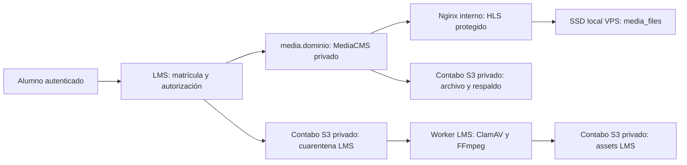

# Arquitectura de vídeo: LMS, MediaCMS y Contabo

Fecha de revisión: 2026-08-03. Esta revisión fue sólo de lectura: no se
crearon credenciales, buckets, contenedores ni se cambiaron datos.

## Decisión recomendada

Usar **el SSD local del VPS como almacenamiento operativo de MediaCMS** y el
Object Storage de Contabo como almacenamiento S3 privado para el LMS y para
copias/archivo. No montar el bucket como `MEDIA_ROOT` de MediaCMS ni activar
su acceso público.

MediaCMS actual guarda originales, codificados y HLS bajo su `MEDIA_ROOT`, y
su protección de reproducción se basa en Nginx/X-Accel sobre esos paths
locales. Un montaje FUSE/S3 para ese árbol añade una dependencia remota para
miles de segmentos HLS pequeños, complica escrituras de transcodificación y
debilita esa ruta de autorización. Por eso no es el primer despliegue correcto.

## Recursos comprobados

| Recurso          |                                                           Estado actual | Lectura operativa                                                                                             |
| ---------------- | ----------------------------------------------------------------------: | ------------------------------------------------------------------------------------------------------------- |
| VPS              |                                                     10 vCPU, 35 GiB RAM | Suficiente para LMS, MediaCMS y transcodificación moderada.                                                   |
| Disco local      |                                               461 GiB libres de 492 GiB | Adecuado para la biblioteca activa y sus rendiciones.                                                         |
| Salida medida    |                           ~480 Mbit/s sostenidos; planificar 360 Mbit/s | 40 alumnos a 720p (~2.8 Mbit/s) consumen ~112 Mbit/s; a 1080p (~4.5 Mbit/s), ~180 Mbit/s.                     |
| Object Storage   |                      250 GB en EU, 0 B usados, autoescalado desactivado | Capacidad inicial de archivo/respaldo; no basta para crecer sin control si se duplican todas las rendiciones. |
| Bucket existente | `archivos`, `https://eu2.contabostorage.com/archivos`, público inactivo | No exponerlo públicamente. Es S3 compatible, no una implementación idéntica a AWS S3.                         |

El VPS ya aloja la pila Laila y Caddy ocupa 80/443. Cualquier servicio nuevo
debe convivir con ella: Caddy sigue como único borde TLS y enruta un subdominio
de MediaCMS hacia una red Docker privada.

## Distribución propuesta

### MediaCMS

- Subdominio: `media.tu-dominio` detrás del Caddy existente; nunca publicar
  directamente puertos de MediaCMS.
- Portal privado, registro público deshabilitado, descarga de originales
  deshabilitada salvo necesidad explícita, revisión editorial activada.
- HLS H.264/AAC: 360p (~0.8 Mbit/s), 480p (~1.4), 720p (~2.8) y 1080p
  (~4.5). Activar 1080p sólo para fuentes que lo justifiquen; 720p debe ser el
  perfil normal para la primera cohorte.
- Mantener `MEDIA_ROOT` sobre un volumen local persistente. El bucket recibe
  una copia verificable de originales y/o un respaldo periódico del catálogo,
  no es el path operativo HLS.
- No ejecutar transcodificaciones pesadas en paralelo con muchas cargas:
  comenzar con una sola tarea de encode y medir antes de aumentar.

### LMS

El repositorio ya tiene un diseño sólido. La conexión a Contabo sigue sin
autorizarse para producción, pero la entrega local de MediaCMS ya existe y se
verificó de extremo a extremo:

- `domain.assets` es propietario de `AssetVersion`, cuarentena, Boto3,
  ClamAV, FFmpeg, URLs firmadas y entrega basada en matrícula/release.
- Los vídeos actuales se validan y normalizan a MP4/poster; HLS/CDN siguen
  expresamente aplazados.
- La configuración de producción rechaza endpoints S3 personalizados y
  credenciales estáticas; por tanto no puede apuntarse al endpoint Contabo
  simplemente llenando variables de entorno.
- `domain.courses` conserva solamente el `media_friendly_token` opaco de una
  unidad de vídeo. `domain.publishing` lo fija en el snapshot v5 y
  `domain.learning` sólo inicia LTI tras comprobar matrícula efectiva y
  release asignado (ADR 0043).
- La LMS firma un `id_token` RS256 de vida corta y MediaCMS consulta el JWKS
  público local. No se comparten cookies, claves de servicio, URLs HLS ni
  URLs firmadas con contenido académico o con el navegador.
- El adaptador local exige que el iframe solicite exactamente el token firmado
  para esa unidad/release y que el usuario pertenezca al contexto LTI creado
  para ese release. Sólo entonces crea la asociación privada MediaCMS--grupo
  y la permisión normal de MediaCMS que Nginx utiliza al servir el archivo.
  Una URL de otro token en esa misma sesión devuelve `403`.

## Uso local de vídeo en una lección

1. Iniciar MediaCMS con `pnpm mediacms:up` y entrar en
   `http://localhost:8091/` con las credenciales que están en
   `.local/mediacms/.env`.
2. Subir el MP4 en MediaCMS, esperar a que termine la codificación y copiar su
   **código MediaCMS** (`media_friendly_token`). El medio permanece en estado
   privado; no se publica el catálogo ni se marca una URL pública.
3. En la revisión editable del curso, crear o elegir una unidad **Vídeo
   MediaCMS**, pegar ese código en “Código de vídeo de MediaCMS” y guardar la
   configuración. El readiness no permite aprobar una unidad de vídeo que no
   tenga código.
4. Completar revisión, aprobación y publicación normal. Un estudiante con una
   matrícula activa al release abre la unidad y recibe un lanzamiento LTI
   efímero; el grupo privado de MediaCMS se vincula automáticamente en el
   primer lanzamiento válido. No hace falta copiar enlaces de MediaCMS a la
   lección.

La prueba local del 2026-08-03 recorrió exactamente este flujo en Chrome:
la unidad publicada mostró el reproductor dentro del aula y un MP4 privado de
28 s avanzó mientras se reproducía. Se probó además que solicitar otro token
en la misma sesión LTI se deniega.

La integración correcta requiere un adaptador de almacenamiento productivo que
soporte endpoint S3 compatible y secretos gestionados, más una prueba contra
Contabo de: multipart, SHA-256, `HeadObject`, copia, URLs firmadas, CORS,
versioning, lifecycle, cifrado solicitado y expiración. Contabo advierte que
su API no es completamente idéntica a AWS; ningún cambio debe pasar a
producción sin esa matriz.

## Buckets a crear cuando se autorice la implantación

No reutilizar `archivos` para todo. Crear nombres con el dominio/entorno real:

1. `lms-assets-quarantine-prod`: privado, expiración corta, CORS sólo para el
   origen LMS, sin URL de descarga.
2. `lms-assets-private-prod`: privado, versioning, acceso únicamente mediante
   URL firmada después de comprobar matrícula/release.
3. `mediacms-archive-prod`: privado, copia/archivo de MediaCMS; sin CORS de
   navegador ni acceso público.

Las claves S3 no van al repositorio, al frontend ni a capturas. Deben rotarse y
entregarse a contenedores mediante un mecanismo de secretos. Se necesita
además una copia fuera de la misma cuenta Contabo para poder hablar de backup
real ante pérdida total de cuenta/proveedor.

## Capacidad inicial y límites

MediaCMS conserva original, codificados y HLS; usar como estimación inicial
unas tres veces el tamaño de los originales dentro del almacenamiento operativo.
Con 461 GiB libres, reservar como máximo 300 GiB para MediaCMS hasta medir el
resto de las aplicaciones y mantener una alarma al 70/80 %. El bucket de 250
GB no debe recibir una copia completa ilimitada: si almacena toda la biblioteca
procesada, su margen práctico es aproximadamente 80 GB de fuentes antes de
considerar redundancia. Si guarda sólo originales, dura más pero continúa
siendo una capacidad finita que debe vigilarse.

Para 30--40 alumnos simultáneos no hace falta CDN el primer día. La prioridad
es HLS adaptativo, TLS, autorización de cada manifest/segmento y métricas.
Un CDN privado con URLs firmadas se evalúa después de una prueba real de 40
reproducciones y medición desde Colombia, no por anticipación.

## Secuencia antes de producción

1. Acordar el dominio y la frontera: MediaCMS será catálogo/transcodificador,
   mientras LMS conserva identidad, matrícula y decisión académica.
2. Crear los buckets privados y una credencial S3 de mínimo privilegio, una
   vez autorizado.
3. Implementar y probar el adaptador Contabo del LMS contra una cuenta/buckets
   de prueba; no relajar cuarentena, checksums ni URLs firmadas.
4. Desplegar MediaCMS en un Compose independiente, PostgreSQL/Redis propios,
   volumen local persistente y ruta Caddy `media.tu-dominio`.
5. Promover el adaptador LMS--MediaCMS LTI 1.3 ya validado localmente a una
   configuración de dominio/TLS real, sin compartir cookies ni dar al
   navegador claves de servicio. Antes de ello, resolver la revocación de las
   permisiones LTI persistentes que crea MediaCMS cuando una matrícula se
   suspende, revoca o cambia de release.
6. Ejecutar pruebas reales: carga, transcodificación, acceso autorizado/no
   autorizado a manifest y segmentos HLS, 40 espectadores, restauración desde
   backup y rotación de credenciales.

## Fuentes técnicas verificadas

- Panel Contabo de esta cuenta: bucket `archivos`, región EU, 250 GB,
  0 B usados y acceso público inactivo.
- [Contabo: endpoint y credenciales S3](https://help.contabo.com/en/support/solutions/articles/103000275473-where-can-i-find-s3-connection-setting-for-object-storage-)
- [Contabo: alcance de compatibilidad S3](https://help.contabo.com/en/support/solutions/articles/103000275459-is-contabo-object-storage-compatible-with-s3-storage-)
- [MediaCMS: capacidades y requisitos](https://github.com/mediacms-io/mediacms)
- [MediaCMS v8.1.3](https://github.com/mediacms-io/mediacms/releases/tag/v8.1.3)
- [MediaCMS settings actuales](https://raw.githubusercontent.com/mediacms-io/mediacms/main/cms/settings.py)
