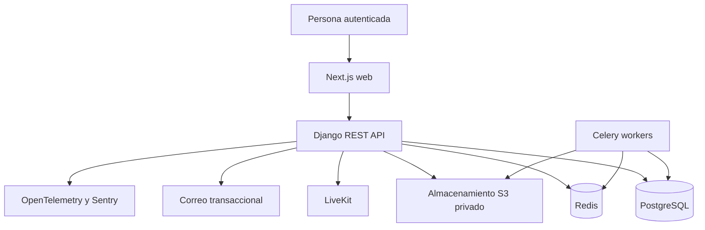

# Arquitectura del sistema

LMS es un monorepo: `apps/web` es el frontend Next.js y `apps/api` el monolito modular Django. Los dos se integran mediante REST/OpenAPI; compartir una base de datos o importar módulos de otro dominio no sustituye ese contrato.

## Contexto y contenedores

PostgreSQL es la autoridad para estado académico, versiones, jobs durables y auditoría. Redis no contiene hechos académicos: sirve como caché, rate limiting y broker. Los workers comparten código con Django, pero no cambian los límites de propiedad de dominio.

## Módulos y dependencias

- `identity` conserva identidad y autenticación; `organizations` conserva tenants, membresías, capacidades e historial de rol.
- `catalog`, `courses` y `content` separan taxonomía, estructura de autoría y documento semántico versionado.
- `publishing` crea snapshots inmutables. `learning` fija matrículas a releases y conserva progreso y eventos.
- `assessments` conserva intentos, respuestas, calificaciones y analítica; no es importado por learning, publishing, courses o content.
- `assets` conserva recursos privados/versionados. Content puede fijar versiones `READY`; learning sólo emite descriptores temporales autorizados.
- `events`, `discovery`, `notifications` e `integrations` agregan capacidades transversales sin convertirse en fuentes alternativas de autoridad.

El mapa ejecutable y las prohibiciones de importación están en `docs/architecture/DOMAIN_MODULES.md`.

## Flujo de solicitud

Next.js conserva una superficie same-origin y reescribe únicamente los prefijos API permitidos. Django valida sesión y CSRF, pasa al servicio o política del dominio, usa PostgreSQL para los hechos y devuelve JSON. Las operaciones de versión y orden bloquean filas necesarias y exigen la versión esperada; las respuestas nunca convierten un error de concurrencia en una escritura silenciosa.
