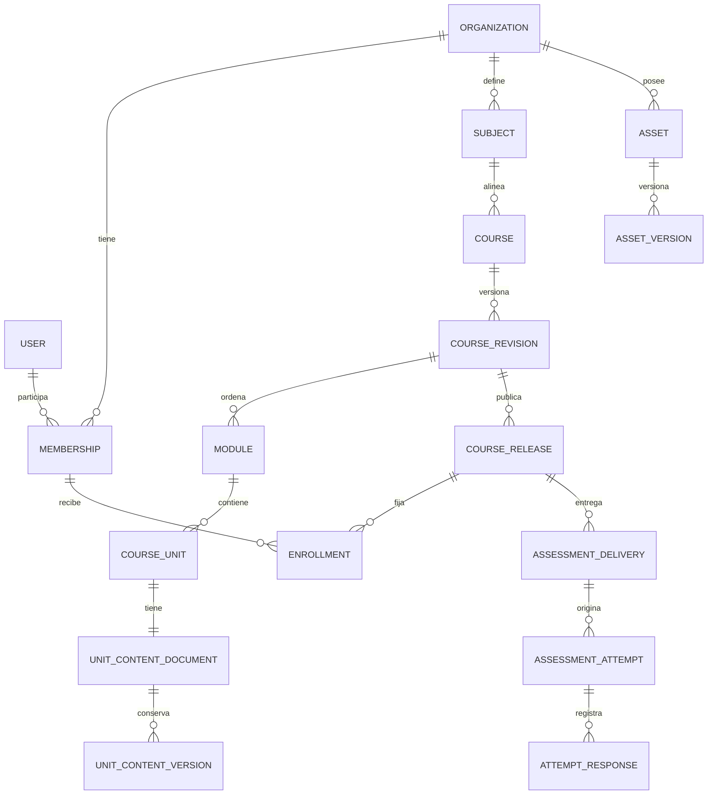

# Modelo de datos

El motor local y productivo previsto es PostgreSQL. Las migraciones de cada dominio son la definición física; este diagrama resume entidades de negocio y omite tablas internas de Django que no son parte del contrato académico.

## Inmutabilidad e historia

`CourseRelease`, versiones de contenido, versiones de recursos y versiones de calificación son append-only. Las transiciones no reescriben snapshots históricos. Archivar, retirar o suspender conserva los registros que explican qué ocurrió y cuándo.

## Restricciones importantes

- Roles y membresías son de organización; una combinación de rol no se representa en `User`.
- La estructura activa de módulos y unidades mantiene posiciones contiguas y usa unicidad diferida en PostgreSQL.
- Los releases y matrículas fijan referencias históricas; un release nuevo no migra estudiantes por sí solo.
- Los objetos de S3, credenciales y URL firmadas no son campos de contenido ni de un release.
- Las restricciones de claves, unicidad, índices y cascadas exactas se revisan en las migraciones de `apps/api/domain/*/migrations` antes de modificar el modelo.

Para el inventario conceptual completo, consulte `docs/architecture/DOMAIN_MODEL.md` y los ADR de cada dominio.
