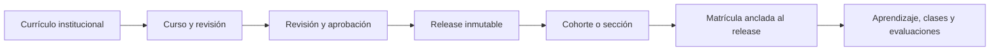

---
hide:
  - path
---

# LMS

Documentación oficial de la plataforma académica LMS: un monorepo con una aplicación web Next.js y una API Django modular. El sistema separa identidad global, gobierno institucional, currículo, autoría, publicación inmutable, aprendizaje, evaluaciones, recursos privados, eventos y operación.

La fuente de verdad es el código, sus migraciones, contratos OpenAPI y pruebas. Esta documentación describe el estado registrado el 3 de agosto de 2026; para trabajo en curso, consulte `docs/project/STATUS.md` en el repositorio.

## Accesos directos

- [Entender el producto](producto/index.md)
- [Empezar a desarrollar](desarrollo/index.md)
- [Consultar la API](api/index.md)
- [Revisar la arquitectura](arquitectura/index.md)
- [Construir y validar esta documentación](pruebas/index.md)

## Inicio local

Desde la raíz del repositorio, instale las dependencias bloqueadas y prepare la infraestructura local una vez:

```powershell
corepack enable
pnpm install --frozen-lockfile
uv sync --locked --directory apps/api --group docs
pnpm infra:init
pnpm infra:up
```

Abra el portal de documentación con un solo comando:

```powershell
pnpm docs:serve
```

El portal queda disponible en `http://127.0.0.1:8100`. El comando genera y valida primero el esquema OpenAPI contra el proyecto Django.

## Qué resuelve

LMS permite que una institución organice su currículo, produzca cursos con revisiones, publique releases inmutables, asigne cohortes y matrículas, entregue experiencias de aprendizaje, gestione sesiones en vivo, evalúe con trazabilidad y distribuya recursos académicos privados. Ninguno de esos límites se resuelve sólo en la interfaz: la API aplica la membresía activa, las capacidades y el alcance institucional en cada operación.



## Estado y alcance

La aplicación contiene funcionalidades académicas avanzadas y también trabajo activo documentado en el estado del proyecto. No se debe interpretar una ruta, un componente o una decisión histórica como promesa de disponibilidad productiva. Las guías distinguen siempre entre comportamiento implementado, controles operativos y preparación de despliegue.

!!! note "Versión documentada"

    El portal usa Zensical `0.0.51`. La API usa Django `6.0.7`, Django REST Framework `3.17.1` y drf-spectacular `0.30.0`; las versiones exactas están en `apps/api/pyproject.toml` y `apps/api/uv.lock`.
