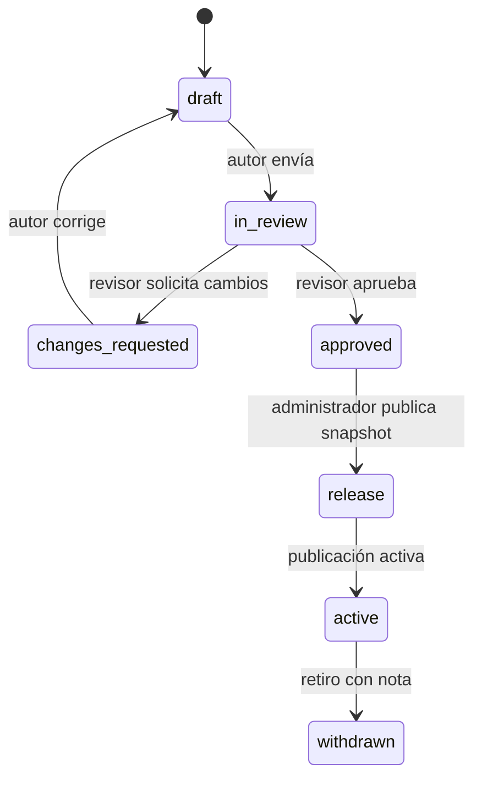
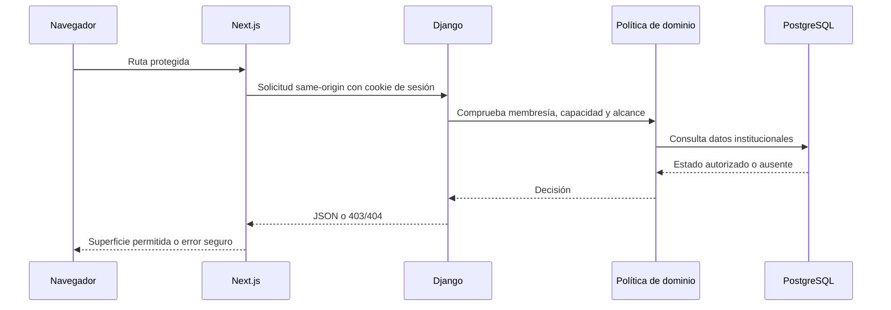
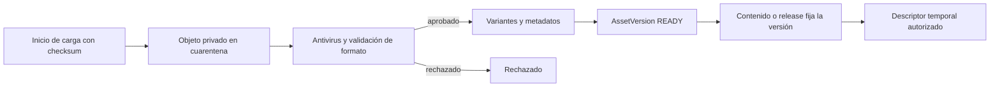

# Flujos académicos

## Autoría, publicación y entrega

El estado de la revisión pertenece a `domain.courses`. La publicación pertenece a `domain.publishing` y no modifica la revisión ni las versiones de contenido. Una matrícula conserva el release asignado aunque se publique otro.

## Sesión y autorización

La sesión es de Django y las mutaciones protegidas usan CSRF. No se persisten JWT, roles, capacidades ni sesiones en `localStorage`, `sessionStorage` o IndexedDB.

## Ciclo de un recurso académico

Un `AssetVersion` `READY` es inmutable. Los bytes y sus variantes siguen siendo privados; el estudiante recibe un descriptor temporal sólo si una matrícula efectiva autoriza el release.
